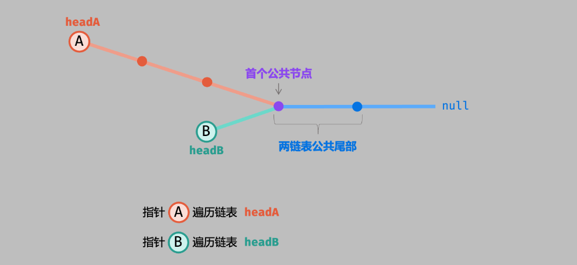

# 数据结构与算法

> author：spongehah
> description：我学习算法时的记录
> 参考网站：
> 1、[Hello算法](https://www.hello-algo.com/)
> 2、[代码随想录](https://programmercarl.com/)（跟着这个的做题顺序）
> 免责声明：以下记录中的 部分图 和 部分文字 都出自于这两个网站

[TOC]

# 数据结构

## 1 数组

### 1.1 二分查找

二分查找也是只适用于 数组，具体详情请看下面的**二分查找**

### 1.2 移除元素

体详情请看下面的**双指针法**

### 1.3 最小子数组

体详情请看下面的**滑动窗口**

### 1.4 螺旋矩阵


相关题目：
[59. 螺旋矩阵 II](https://leetcode.cn/problems/spiral-matrix-ii/)
[54. 螺旋矩阵](https://leetcode.cn/problems/spiral-matrix/)
[剑指Offer 29.顺时针打印矩阵](https://leetcode.cn/problems/shun-shi-zhen-da-yin-ju-zhen-lcof/)

解法：
1 左闭右开 模拟顺时针遍历
2 普通模拟顺时针遍历

59.螺旋矩阵 II 举例：

```java
//左闭右开 模拟顺时针遍历
class Solution {
    public int[][] generateMatrix(int n) {
        int loop = 0; //循环次数
        int start = 0; //循环开始点(start,start)
        int count = 1; //递增填充数字
        int i,j;
        int [][] res = new int[n][n];

        while(loop++ < n/2) {
            //上侧从左到右
            for(j = start; j < n - loop; j++) res[start][j] = count++;

            //右侧从上到下
            for(i = start; i < n - loop; i++) res[i][j] = count++;

            //下侧从右到左
            for(; j >= loop; j--) res[i][j] = count++;

            //左侧从下到上
            for(; i >= loop; i--) res[i][j] = count++;
            
            start++;
        }

        if (n % 2 == 1) {
            res[start][start] = count;
        }
        return res;
    }
}
```

```java
//普通模拟顺时针遍历
class Solution {
    public int[][] generateMatrix(int n) {
        //定义 左右上下 边界的初始值
        int l = 0, r = n - 1, t = 0, b = n - 1;
        int [][] res = new int[n][n];
        int tar = n * n;
        int num = 1;

        while(num <= tar) {
            //left to right
            for(int i = l; i <= r; i++) res[t][i] = num++;
            t++;

            //top to bottom
            for(int i = t; i <= b; i++) res[i][r] = num++;
            r--;

            //right to left
            for(int i = r; i >= l; i--) res[b][i] = num++;
            b--;

            //bottom to top
            for(int i = b; i >= t; i--) res[i][l] = num++;
            l++;
        }
        return res;
    }
}

//非正方形矩阵时，使用以下循环：
while(true) {
    for(...) ...
	if(num == tar) break;
    
    for(...) ...
	if(num == tar) break;
    ...
}
```

### 1.5 小总结

> 图出自文章顶部声明的参考网站：[代码随想录](https://programmercarl.com/)


## 2 链表

> 正常的链表，头节点head指向的就是链表中第一个节点，但是当我们想要对头节点进行修改的时候就会不方便，所以我们可以**引入一个虚拟头节点dummyHead，使dummyHead的next节点为链表中第一个节点**

### 2.1 移除链表元素

[203.移除链表元素](https://leetcode.cn/problems/remove-linked-list-elements/)

给你一个链表的头节点 `head` 和一个整数 `val` ，请你删除链表中所有满足 `Node.val == val` 的节点，并返回 **新的头节点** 。

```java
class Solution {
    public ListNode removeElements(ListNode head, int val) {
        ListNode dummyHead = new ListNode(0);
        //设置一个虚拟头节点，会方便操作很多
        dummyHead.next = head;
        ListNode temp = dummyHead;
        while (temp.next != null) {
            if (temp.next.val == val) {
                temp.next = temp.next.next;
            } else {
                temp = temp.next;
            }
        }
        return dummyHead.next;
    }
}
```

### 2.2 手写单向链表

[707. 设计链表](https://leetcode.cn/problems/design-linked-list/)

题目要求：

- `MyLinkedList()` 初始化 `MyLinkedList` 对象。
- `int get(int index)` 获取链表中下标为 `index` 的节点的值。如果下标无效，则返回 `-1` 。
- `void addAtHead(int val)` 将一个值为 `val` 的节点插入到链表中第一个元素之前。在插入完成后，新节点会成为链表的第一个节点。
- `void addAtTail(int val)` 将一个值为 `val` 的节点追加到链表中作为链表的最后一个元素。
- `void addAtIndex(int index, int val)` 将一个值为 `val` 的节点插入到链表中下标为 `index` 的节点之前。如果 `index` 等于链表的长度，那么该节点会被追加到链表的末尾。如果 `index` 比长度更大，该节点将 **不会插入** 到链表中。
- `void deleteAtIndex(int index)` 如果下标有效，则删除链表中下标为 `index` 的节点。

设置一个**虚拟头节点**

```java
class ListNode {
    int val;
    ListNode next;
    public ListNode(){}
    public ListNode(int val) {this.val = val;}
}

class MyLinkedList {
    int size;
    //虚拟头节点，不是真的头节点
    ListNode dummyHead;

    public MyLinkedList() {
        dummyHead = new ListNode(0);//默认值0
        size = 0;
    }
    
    public int get(int index) {
        if(index < 0 || index >= size) {
            return -1;
        }
        ListNode currentNode = dummyHead;
        for(int i = 0; i <= index; i++) {
            currentNode = currentNode.next;
        }
        return currentNode.val;
    }
    
    public void addAtIndex(int index, int val) {
         if(index < 0 || index > size) {
            return;
        }
        size++;
        //要插入位置的前一个节点
        ListNode pre = dummyHead;
        for(int i = 0; i < index; i++) {
            pre = pre.next;
        }
        ListNode node = new ListNode(val);
        node.next = pre.next;
        pre.next = node;
    }
    
    public void addAtHead(int val) {
        ListNode node = new ListNode(val);
        node.next = dummyHead.next;
        dummyHead.next = node;
        size++;
        //也可以使用：this.addAtIndex(0, val);
    }
    
    public void addAtTail(int val) {
       this.addAtIndex(size, val);
    }
    
    public void deleteAtIndex(int index) {
        if(index < 0 || index >= size) {
            return;
        }
        size--;
        ListNode pre = dummyHead;
        for(int i = 0; i < index; i++) {
            pre = pre.next;
        }
        pre.next = pre.next.next;
    }
}
```

### 2.3 手写双向链表

还是题：[707. 设计链表](https://leetcode.cn/problems/design-linked-list/)

设置一个**虚拟头节点**和**虚拟尾节点**，都不算在链表元素里

```java
class ListNode {
    int val;
    ListNode next, prev;
    public ListNode(){}
    public ListNode(int val) {this.val = val;}
}

class MyLinkedList {
    int size;
    //虚拟头节点 和 虚拟尾节点，都不算在链表元素里
    ListNode dummyHead, tail;

    public MyLinkedList() {
        dummyHead = new ListNode(0);//默认值0
        tail = new ListNode(0);
        size = 0;
        dummyHead.next = tail;
        tail.prev = dummyHead;
    }
    
    public int get(int index) {
        if(index < 0 || index >= size) {
            return -1;
        }
        ListNode currentNode = dummyHead;
        //判断从哪边遍历时间更短
        if(index >= size / 2) {
            currentNode = tail;
            for(int i = size; i > index; i--){
                currentNode = currentNode.prev;
            }
        }else {
            for(int i = 0; i <= index; i++) {
                currentNode = currentNode.next;
            }   
        }
        return currentNode.val;
    }
    
    public void addAtHead(int val) {
        ListNode node = new ListNode(val);
        node.next = dummyHead.next;
        dummyHead.next.prev = node;
        node.prev = dummyHead;
        dummyHead.next = node;
        size++;
        //也可以使用：this.addAtIndex(0, val);
    }
    
    public void addAtTail(int val) {
       this.addAtIndex(size, val);
    }
    
    public void addAtIndex(int index, int val) {
         if(index < 0 || index > size) {
            return;
        }
        size++;
        //要插入位置的前一个节点
        ListNode pre = dummyHead;
        for(int i = 0; i < index; i++) {
            pre = pre.next;
        }
        ListNode node = new ListNode(val);
        node.next = pre.next;
        pre.next.prev = node;
        node.prev = pre;
        pre.next = node;
    }
    
    public void deleteAtIndex(int index) {
        if(index < 0 || index >= size) {
            return;
        }
        size--;
        ListNode pre = dummyHead;
        for(int i = 0; i < index; i++) {
            pre = pre.next;
        }
        pre.next.next.prev = pre;
        pre.next = pre.next.next;
    }
}
```

### 2.4 反转链表

[206.反转链表](https://leetcode.cn/problems/reverse-linked-list/)

```java
//双指针法
class Solution {
    public ListNode reverseList(ListNode head) {
        ListNode cur = head, prev = null, temp = null;
        while(cur != null) {
            temp = cur.next;
            cur.next = prev;
            prev = cur;
            cur = temp;
        }
        return prev;//cur == null，返回prev
    }
}
```

```java
//递归法
class Solution {
    public ListNode reverseList(ListNode head) {
        return recur(head, null);    // 调用递归并返回
    }
    private ListNode recur(ListNode pre, ListNode cur) {
        if (cur == null) return pre; // 终止条件
        ListNode res = recur(cur, cur.next);  // 递归后继节点
        cur.next = pre;              // 修改节点引用指向
        return res;                  // 返回反转链表的头节点
    }
}
```

> 还可以使用栈的方式
> 还可以使用虚拟头节点进行头插的方式

### 2.5 两两交换相邻节点

[24.两两交换链表中的节点](https://leetcode.cn/problems/swap-nodes-in-pairs/)

```java
//双指针法
class Solution {
    public ListNode swapPairs(ListNode head) {
        ListNode dummyHead = new ListNode(0);
        dummyHead.next = head;
        ListNode cur = dummyHead.next;
        ListNode pre =  dummyHead, next = null;
        int count = 0;
        while(cur != null) {
          if(cur.next != null) {//可以和while合并条件
            next = cur.next;
            pre.next = next;
            cur.next = next.next;
            next.next = cur;
            pre = cur;
          }
          cur = cur.next;
        }
        return dummyHead.next;
    }
}
```

### 2.6 移除链表的倒数第 N 个结点

[19.删除(移除)链表的倒数第 N 个结点](https://leetcode.cn/problems/remove-nth-node-from-end-of-list/)

```java
//双指针法
class Solution {
    public ListNode removeNthFromEnd(ListNode head, int n) {
        ListNode dummyHead = new ListNode(0);
        dummyHead.next = head;
        ListNode cur = dummyHead.next;
        ListNode slowIndex = dummyHead, fastIndex = cur;

        while(fastIndex != null && n-- > 0) {
            fastIndex = fastIndex.next;
        }

        // while(cur != null) {
        //     if(fastIndex == null) {
        //         slowIndex.next = cur.next;
        //         break;
        //     }
        //     cur = cur.next;
        //     fastIndex = fastIndex.next;
        //     slowIndex = slowIndex.next;
        // }

        while(fastIndex != null) {
            cur = cur.next;
            fastIndex = fastIndex.next;
            slowIndex = slowIndex.next;
        }
        slowIndex.next = cur.next;
        return dummyHead.next;
    }
}
//还可以使用栈的方式
```

### 2.7 相交链表

[160.相交链表](https://leetcode.cn/problems/intersection-of-two-linked-lists/)



思路：让长的链表的指针移动到短的链表的起始指针处对齐，然后同时向后移动两个指针，直到相等或遍历完

```java
//上面的思路
public class Solution {
    public ListNode getIntersectionNode(ListNode headA, ListNode headB) {
        ListNode A = headA, B = headB;
        while (A != B) {
            A = A != null ? A.next : headB;
            B = B != null ? B.next : headA;
        }
        return A;
    }
}

//使用集合Map，不用List是因为list.contains()时间复杂度为O(n)，而map.containsKey()时间复杂度为O(1)
public class Solution {
    public ListNode getIntersectionNode(ListNode headA, ListNode headB) {
        ListNode curA = headA, curB = headB;

        Map<ListNode,String> map = new HashMap<>();
        while(curB != null) {
            map.put(curB,"");
            curB = curB.next;
        }

        while(curA != null) {
            if(map.containsKey(curA)) {
                return curA;
            }
            curA = curA.next;
        }
        return null;
    }
}

//还可以使用栈，先两个链表全部入栈，然后出栈时两个链表尾部正好对齐，直到遇到不相等的节点
```

### 2.8 环形链表Ⅱ

[142.环形链表 II](https://leetcode.cn/problems/linked-list-cycle-ii/)

双指针法思路：

1. f=2s （快指针每次2步，路程刚好2倍）
2. f = s + nb (相遇时，刚好多走了n圈）

推出：s = nb

从head结点走到入环点需要走 ： a + nb， 而slow已经走了nb，那么slow再走a步就是入环点了。

如何知道slow刚好走了a步？ 从head开始，和slow指针一起走，相遇时刚好就是a步

```java
//双指针法
public class Solution {
    public ListNode detectCycle(ListNode head) {
        ListNode slow = head, fast = head;
        while(true) {
            if(fast == null || fast.next == null) return null;
            fast = fast.next.next;
            slow = slow.next;
            if(fast == slow) break;
        }
        fast = head;
        while(slow != fast) {
            slow = slow.next;
            fast = fast.next;
        }
        return slow;
    }
}
```

```java
//使用集合Map，不用List是因为list.contains()时间复杂度为O(n)，而map.containsKey()时间复杂度为O(1)
public class Solution {
    public ListNode detectCycle(ListNode head) {
        Map<ListNode,String> map = new HashMap<>();
        ListNode cur = head;
        while(cur != null) {
            if(map.containsKey(cur)) {
                return cur;
            }
            map.put(cur,"");
            cur = cur.next;
        }
        return null;
    }
}
```

### 2.9 小总结

> 图出自文章顶部声明的参考网站：[代码随想录](https://programmercarl.com/)


## 3 哈希表

### 3.1 字母异位词

[242. 有效的字母异位词](https://leetcode.cn/problems/valid-anagram/)
[49. 字母异位词分组](https://leetcode.cn/problems/group-anagrams/)
[438.找到字符串中所有字母异位词](https://leetcode.cn/problems/find-all-anagrams-in-a-string/)	 <=> 找到字符串中由另一个字符串的字符所组成的字串 -> 滑动窗口

242.有效的字母异位词 举例：

```java
class Solution {
    public boolean isAnagram(String s, String t) {
        //使用哈希表计数
        Map<Character, Integer> map = new HashMap<>(26);//一共就26个英文字母（小写）
        for(int i = 0; i < s.length(); i++) {
            map.put(s.charAt(i), map.getOrDefault(s.charAt(i), 0) + 1);
        }
        for(int i = 0; i < t.length(); i++) {
            map.put(t.charAt(i), map.getOrDefault(t.charAt(i), 0) - 1);
        }
        for(int val : map.values()) {
            if(val != 0) {
                return false;
            }
        }
        return true;
    }
}
```

438.找到字符串中所有字母异位词 举例在滑动窗口中

### 3.2 两数之和 与 四数相加Ⅱ

[1. 两数之和](https://leetcode.cn/problems/two-sum/)
[454. 四数相加 II](https://leetcode.cn/problems/4sum-ii/)

还有 三数之和 与 四数之和 不适合用哈希表，适合用**双指针法**，题目链接在双指针法中

```java
//1. 两数之和
class Solution {
    public int[] twoSum(int[] nums, int target) {
        Map<Integer, Integer> map = new HashMap<>();
        int[] res = new int[2];

        for(int i = 0; i < nums.length; i++) {
            int temp = target - nums[i];
            if(map.containsKey(temp)) {
                res[0] = i;
                res[1] = map.get(temp);
                break;
            }
            map.put(nums[i], i);
        }
        return res;
    }
}
```

```java
//454. 四数相加 II
class Solution {
    public int fourSumCount(int[] nums1, int[] nums2, int[] nums3, int[] nums4) {
        Map<Integer, Integer> map = new HashMap<>();
        for(int i : nums1) {
            for(int j : nums2) {
                map.put(i + j, map.getOrDefault(i + j, 0) + 1);
            }
        }

        int count = 0;
        for(int i : nums3) {
            for(int j : nums4) {
                count += map.getOrDefault(0 -i - j, 0);
            }
        }
        return count;
    }
}
```

### 3.3 其它

[202. 快乐数](https://leetcode.cn/problems/happy-number/)
[383. 赎金信](https://leetcode.cn/problems/ransom-note/)

## 4 字符串

### 4.1 反转字符串

[344.反转字符串](https://leetcode.cn/problems/reverse-string/)
[541. 反转字符串 II](https://leetcode.cn/problems/reverse-string-ii/)

使用双指针法

```java
//344.反转字符串
class Solution {
    public void reverseString(char[] s) {
        int left = 0, right = s.length - 1;
        while(left < right) {
            char temp = s[left];
            s[left] = s[right];
            s[right] = temp;
            left++;
            right--;
        }
    }
}
```

```java
//541. 反转字符串 II
class Solution {
    public String reverseStr(String s, int k) {
        int start = 0;
        char[] chars = s.toCharArray();
        int length = chars.length;
        while(start < length) {
            int firstK = (start + k > length ? length : start + k);
            int secondK = (start + (2*k) > length ? length : start + (2*k));
            reverse(chars, start, firstK - 1);
            start += (2*k);
        }

        return new String(chars);
    }

    private void reverse(char[] chars, int left, int right) {
        while(left < right) {
            char temp = chars[left];
            chars[left] = chars[right];
            chars[right] = temp;
            left++;
            right--;
        }
    }
}
```

### 4.2 反转字符串中的单词

[151. 反转字符串中的单词](https://leetcode.cn/problems/reverse-words-in-a-string/)

```java
//双指针法
class Solution {
    public String reverseWords(String s) {
        s = s.trim();
        StringBuilder sb = new StringBuilder();

        int right = s.length();
        int left = 0;
        for(int i = s.length() - 1; i >= 0; i--) {
            if(s.charAt(i) == ' ') {
                left = i + 1;
                sb.append(s.substring(left, right) + " ");
                while(i >= 0 && s.charAt(i - 1) == ' ') {
                    i--;
                }
                right = i;
            }else if(i == 0) {
                left = i;
                sb.append(s.substring(left, right));
            }
        }
        return sb.toString();
    }
}
```

### 4.3 实现strStr()

[28. 找出字符串中第一个匹配项的下标](https://leetcode.cn/problems/find-the-index-of-the-first-occurrence-in-a-string/)	即实现strStr()

解答在 《KMP前缀表算法》中，可以用KMP、滑动窗口、用java的substring()三种方法

### 4.4 重复的子字符串

[459. 重复的子字符串](https://leetcode.cn/problems/repeated-substring-pattern/)

也是使用KMP算法，解答在 《KMP前缀表算法》中

## 5 栈和队列

### 5.1 栈

[20. 有效的括号](https://leetcode.cn/problems/valid-parentheses/)

```java
class Solution {

    Stack<Character> stack = new Stack<>();

    public boolean isValid(String s) {
        char[] chars = s.toCharArray();
        
        for(char ch : chars) {
            if(!stack.isEmpty()) {
                if(verify(ch)) {
                    stack.pop();
                    continue;
                }
            }
            stack.push(ch);
        }
        return stack.isEmpty();
    }

    private boolean verify(char ch) {
        char peek = stack.peek();
        return (peek == '{' && ch == '}') || (peek == '(' && ch == ')') || (peek == '[' && ch == ']');
    }
}
```

[1047. 删除字符串中的所有相邻重复项](https://leetcode.cn/problems/remove-all-adjacent-duplicates-in-string/)	区别去重，去重是移除相等的值，这个是动态去除相邻重复项

```java
class Solution {
    public String removeDuplicates(String s) {
        // Stack<Charater> stack = new Stack<>();
        //模拟栈
        StringBuilder stackSB = new StringBuilder();
        for(int i = 0; i < s.length(); i++) {
            if(stackSB.length() > 0 && s.charAt(i) == stackSB.charAt(stackSB.length() - 1)) {
                stackSB.deleteCharAt(stackSB.length() - 1);
                continue;
            }
            stackSB.append(s.charAt(i));
        }
        return stackSB.toString();
    }
}
```

[150. 逆波兰表达式求值](https://leetcode.cn/problems/evaluate-reverse-polish-notation/)

```java
class Solution {
    public int evalRPN(String[] tokens) {
        Deque<Integer> stack = new LinkedList();
        for (String s : tokens) {
            if ("+".equals(s)) {        // leetcode 内置jdk的问题，不能使用==判断字符串是否相等
                stack.push(stack.pop() + stack.pop());      // 注意 - 和/ 需要特殊处理
            } else if ("-".equals(s)) {
                stack.push(-stack.pop() + stack.pop());
            } else if ("*".equals(s)) {
                stack.push(stack.pop() * stack.pop());
            } else if ("/".equals(s)) {
                int temp1 = stack.pop();
                int temp2 = stack.pop();
                stack.push(temp2 / temp1);
            } else {
                stack.push(Integer.valueOf(s));
            }
        }
        return stack.pop();
    }
}
```

### 5.2 队列

[239. 滑动窗口最大值](https://leetcode.cn/problems/sliding-window-maximum/)

```java
class Solution {
    public int[] maxSlidingWindow(int[] nums, int k) {
        Deque<Integer> deque = new ArrayDeque<>();
        int len = nums.length;
        int[] res = new int[len - k + 1];
        int index = 0;//数组下标

        for(int i = 0; i < len; i++) {
            //如果对应的下标不在滑动窗口内，就移除
            while(!deque.isEmpty() && deque.peekFirst() < i - k + 1) {
                deque.pollFirst();
            }

            //保证队列里的元素按照从队头到队尾是从大到小排列的，若不是从大到小排列，则移除非递减的部分，然后插入元素
            while(!deque.isEmpty() && nums[i] > nums[deque.peekLast()]) {
                deque.pollLast();
            }

            deque.offerLast(i);

            //从第一个窗口右侧开始放入元素
            if(i >= k - 1) {
                res[index++] = nums[deque.peekFirst()];
            }
        }
        return res;
    }
}
```

[347. 前 K 个高频元素](https://leetcode.cn/problems/top-k-frequent-elements/)

```java
//代码随想录答案
public int[] topKFrequent(int[] nums, int k) {
        Map<Integer,Integer> map = new HashMap<>();//key为数组元素值,val为对应出现次数
        for(int num:nums){
            map.put(num,map.getOrDefault(num,0)+1);
        }
        //在优先队列中存储二元组(num,cnt),cnt表示元素值num在数组中的出现次数
        //出现次数按从队头到队尾的顺序是从大到小排,出现次数最多的在队头(相当于大顶堆)
        PriorityQueue<int[]> pq = new PriorityQueue<>((pair1, pair2)->pair2[1]-pair1[1]);
        for(Map.Entry<Integer,Integer> entry:map.entrySet()){//大顶堆需要对所有元素进行排序
            pq.add(new int[]{entry.getKey(),entry.getValue()});
        }
        int[] ans = new int[k];
        for(int i=0;i<k;i++){//依次从队头弹出k个,就是出现频率前k高的元素
            ans[i] = pq.poll()[0];
        }
        return ans;
    }
}

//我做的，因为是队列题，所以推荐代码随想录的答案
public int[] topKFrequent(int[] nums, int k) {
    Map<Integer, Integer> map = new HashMap<>();
    for(int num : nums) {
        map.put(num, map.getOrDefault(num, 0) + 1);
    }
    //模拟大顶堆，这里我们可以参考代码随想录用PriorityQueue
    List<Map.Entry<Integer, Integer>> list = new ArrayList<>();
    list.addAll(map.entrySet());
    list.sort((entry1, entry2) -> entry2.getValue() - entry1.getValue());
    list = list.subList(0, k);
    int[] res = new int[k];
    int index = 0;
    for (Map.Entry<Integer, Integer> entry : list) {
        res[index++] = entry.getKey();
    }
    return res;
}
```


## 6 二叉（搜索）树

> 图出自文章顶部声明的参考网站：[代码随想录](https://programmercarl.com/)


### 6.1 二叉树的遍历

#### 1 递归遍历

[144.二叉树的前序遍历](https://leetcode.cn/problems/binary-tree-preorder-traversal/)
[145.二叉树的后序遍历](https://leetcode.cn/problems/binary-tree-postorder-traversal/)
[94.二叉树的中序遍历](https://leetcode.cn/problems/binary-tree-inorder-traversal/)

以前序遍历举例：

```java
//递归法
public List<Integer> preorderTraversal(TreeNode root) {
    List<Integer> result = new ArrayList<>();
    preOrder(root, result);
    return result;
}
private void preOrder(TreeNode root, List<Integer> result) {
    if(root == null) return;
    result.add(root.val);
    preOrder(root.left, result);
    preOrder(root.right, result);
}
```

#### 2 统一迭代遍历

以前序遍历举例：

```java
// 迭代法
public List<Integer> preorderTraversal(TreeNode root) {
    // 使用栈
    Stack<TreeNode> stack = new Stack<>();
    List<Integer> result = new ArrayList<>();
    if(root != null) stack.push(root);
    while(!stack.isEmpty()) {
        TreeNode node = stack.peek();
        if(node != null) {
            stack.pop();
            if(node.right != null) stack.push(node.right);
            if(node.left != null) stack.push(node.left);
            //遍历顺序：从后往前出栈
            stack.push(node);
            stack.push(null);   //访问过但没有处理的数据做标记
        } else {
            stack.pop();
            node = stack.pop();
            result.add(node.val);
        }
    }
    return result;
}
```

#### 3 层序遍历

[102.二叉树的层序遍历](https://leetcode.cn/problems/binary-tree-level-order-traversal/)
[107.二叉树的层次遍历II](https://leetcode.cn/problems/binary-tree-level-order-traversal-ii/)
[199.二叉树的右视图](https://leetcode.cn/problems/binary-tree-right-side-view/)
[637.二叉树的层平均值](https://leetcode.cn/problems/average-of-levels-in-binary-tree/)
[429.N叉树的层序遍历](https://leetcode.cn/problems/n-ary-tree-level-order-traversal/)
[515.在每个树行中找最大值](https://leetcode.cn/problems/find-largest-value-in-each-tree-row/)
[116.填充每个节点的下一个右侧节点指针](https://leetcode.cn/problems/populating-next-right-pointers-in-each-node/)
[117.填充每个节点的下一个右侧节点指针II](https://leetcode.cn/problems/populating-next-right-pointers-in-each-node-ii/)
[104.二叉树的最大深度](https://leetcode.cn/problems/maximum-depth-of-binary-tree/)
[111.二叉树的最小深度](https://leetcode.cn/problems/minimum-depth-of-binary-tree/)

```java
class Solution {

    List<List<Integer>> resList = new ArrayList<>();
    public List<List<Integer>> levelOrder(TreeNode root) {
        // BFS(root);
        DFS(root, 0);
        return resList;
    }

    // DFS深搜：递归
    // 就是在普通递归遍历的基础上加上新建子列表和修改d	epth-1的子列表，就变成了层次遍历
    private void DFS(TreeNode node, Integer depth) {
        if(node == null) return;
        depth++;

        //该层第一个遍历的节点才会创建itemList
        while(resList.size() < depth) {
            List<Integer> item = new ArrayList<>();
            resList.add(item);
        }

        //depth传入时定死为形参，不会跟着其它递归改变
        resList.get(depth - 1).add(node.val);

        //递归
        DFS(node.left, depth);
        DFS(node.right, depth);
    }

    // BFS广搜：借助队列
    private void BFS(TreeNode node) {
        Queue<TreeNode> queue = new LinkedList<>();
        if(node != null) queue.offer(node);
        while(!queue.isEmpty()) {
            List<Integer> itemList = new ArrayList<>();
            int len = queue.size();
            
            while(len-- > 0) {
                TreeNode tempNode = queue.poll();
                itemList.add(tempNode.val);

                if(tempNode.left != null) queue.offer(tempNode.left);
                if(tempNode.right != null) queue.offer(tempNode.right);
            }
            resList.add(itemList);
        }
    }
}
```

### 6.2 二叉树的属性

#### 1 对称 / 相同二叉树

[101. 对称二叉树](https://leetcode.cn/problems/symmetric-tree/)

```java
class Solution {
    public boolean isSymmetric(TreeNode root) {
        // 递归法
        // return compare(root.left, root.right);

        // 迭代法
        // 注意与层序遍历有一定区别，这里不用判断len用于区别每层
        Queue<TreeNode> que = new LinkedList<>();
        if(root != null) {
            que.offer(root.left);
            que.offer(root.right);
        }
        while(!que.isEmpty()) {
            TreeNode left = que.poll();
            TreeNode right = que.poll();

            if(left == null && right == null) continue;
            if(left == null && right != null || left != null && right == null || left.val != right.val) {
                return false;
            }
            
            que.offer(left.left);
            que.offer(right.right);

            que.offer(left.right);
            que.offer(right.left);
        }
        return true;
    }

    // 递归法
    // private boolean compare(TreeNode left, TreeNode right) {
    //     if(left == null && right == null) {
    //         return true;
    //     }

    //     if(left == null && right != null || left != null && right == null || left.val != right.val) {
    //         return false;
    //     }
        
    //     return compare(left.left, right.right) && compare(left.right, right.left);
    // }
}
```

[100. 相同的树](https://leetcode.cn/problems/same-tree/)

```java
class Solution {
    public boolean isSameTree(TreeNode p, TreeNode q) {
        Queue<TreeNode> que = new LinkedList<>();
        que.offer(p);
        que.offer(q);
        while(!que.isEmpty()) {
            TreeNode node1 = que.poll();
            TreeNode node2 = que.poll();

            if(node1 == null && node2 == null) {
                continue;
            }
            if(node1 == null && node2 != null || node1 != null && node2 == null || node1.val != node2.val) {
                return false;
            }
            que.offer(node1.left);	//相比判断是否对称，就只有这里的入队变了
            que.offer(node2.left);

            que.offer(node1.right);
            que.offer(node2.right);
        }
        return true;
    }
}
```

#### 2 二叉树的最大 / 小深度

[104.二叉树的最大深度](https://leetcode.cn/problems/maximum-depth-of-binary-tree/)
[111.二叉树的最小深度](https://leetcode.cn/problems/minimum-depth-of-binary-tree/)

使用层序遍历

#### 3 完全二叉树的节点个数

[222. 完全二叉树的节点个数](https://leetcode.cn/problems/count-complete-tree-nodes/)

```java
class Solution {
    // 法1：递归法
    // int num = 0;
    // public int countNodes(TreeNode root) {
    //     preOrder(root);
    //     return num;
    // }

    // private void preOrder(TreeNode root) {
    //     if(root == null) return;
    //     num++;
    //     preOrder(root.left);
    //     preOrder(root.right);
    // }

    // 法2：层次迭代法
    // public int countNodes(TreeNode root) {
    //     Queue<TreeNode> que = new LinkedList<>();
    //     if(root != null) que.offer(root);
    //     int num = 0;
    //     while(!que.isEmpty()) {
    //         int len = que.size();
    //         while(len-- > 0) {
    //             TreeNode tempNode = que.poll();
    //             num++;
    //             if(tempNode.left != null) que.offer(tempNode.left);
    //             if(tempNode.right != null) que.offer(tempNode.right);
    //         }
    //     }
    //     return num;
    // }

    // 法3：判断是否为完全二叉树
    public int countNodes(TreeNode root) {
        if(root == null) return 0;
        int leftCount = 0, rightCount = 0;
        TreeNode left = root.left, right = root.right;
        while(left != null) {
            left = left.left;
            leftCount++;
        }
        while(right != null) {
            right = right.right;
            rightCount++;
        }
        // 完美二叉树的节点数量为 2^h - 1
        if(leftCount == rightCount) return (2 << leftCount) - 1;
        return countNodes(root.left) + countNodes(root.right) + 1;
    }
}
```

#### 4 平衡二叉树

[110. 平衡二叉树](https://leetcode.cn/problems/balanced-binary-tree/)

```java
// 解法1：嵌套层次遍历，时间复杂度O(n^2)
public boolean isBalanced(TreeNode root) {
    Queue<TreeNode> que = new LinkedList<>();
    if(root != null) que.offer(root);
    while(!que.isEmpty()) {
        int len = que.size();
        while(len-- > 0) {
            TreeNode tempNode = que.poll();
            int leftHeight = getHeight(tempNode.left);
            int rightHeight = getHeight(tempNode.right);
            if(Math.abs(leftHeight - rightHeight) > 1) {
                return false;
            }
            if(tempNode.left != null) que.offer(tempNode.left);
            if(tempNode.r	ight != null) que.offer(tempNode.right);
        }
    }
    return true;
}
private int getHeight(TreeNode root) {
    if(root == null) return 0;
    Queue<TreeNode> que = new LinkedList<>();
    int depth = 0;
    que.offer(root);
    while(!que.isEmpty()) {
        depth++;
        int len = que.size();
        while(len-- > 0) {
            TreeNode tempNode = que.poll();
            if(tempNode.left != null) que.offer(tempNode.left);
            if(tempNode.right != null) que.offer(tempNode.right);
        }
    }
    return depth;
}
```

```java
// 解法2：递归，时间复杂度O(n)
public boolean isBalanced(TreeNode root) {
    return getHeight(root) != -1;
}
// 求高度使用后序遍历，求深度使用前序遍历
private int getHeight(TreeNode root) {
    if(root == null) return 0;
    int leftHeight = getHeight(root.left);      //左
    if(leftHeight == -1) return -1;
    int rightHeight = getHeight(root.right);    //右
    if(rightHeight == -1) return -1;
    return Math.abs(leftHeight - rightHeight) > 1 ? -1 : Math.max(leftHeight, rightHeight) + 1;		//中
}
```

#### 5 二叉树的所有路径

[257. 二叉树的所有路径](https://leetcode.cn/problems/binary-tree-paths/)


```java
public List<String> binaryTreePaths(TreeNode root) {
    // 解法1：回溯
    List<String> res = new ArrayList<>();
    List<Integer> path = new ArrayList<>();
    if(root == null) return res;
    traversal(root, path, res);
    return res;
}
private void traversal(TreeNode root, List<Integer> path, List<String> res) {
    path.add(root.val); //前序遍历：中
    // 终止条件：找到叶子节点
    if(root.left == null && root.right == null) {
        StringBuilder s = new StringBuilder();
        for(int i = 0; i < path.size() - 1; i++) {
            s.append(path.get(i)).append("->");
        }
        s.append(path.get(path.size() - 1));
        res.add(s.toString());
        return;
    }
    if(root.left != null) {     //左
        traversal(root.left, path, res);
        path.remove(path.size() - 1);   //回溯
    }
    if(root.right != null) {    //右
        traversal(root.right, path, res);
        path.remove(path.size() - 1);   //回溯
    }
}
```

```java
public List<String> binaryTreePaths(TreeNode root) {
    // 解法2：迭代
    Queue<Object> que = new LinkedList<>();
    List<String> res = new ArrayList<>();
    if(root == null) return res;
    que.offer(root);
    que.offer("" + root.val);   //节点和路径成对放入
    while(!que.isEmpty()) {
        TreeNode node = (TreeNode)que.poll();
        String path = (String)que.poll();
        if(node.left == null && node.right == null) {
            res.add(path);
        }
        if(node.left != null) {
            que.offer(node.left);
            que.offer(path + "->" + node.left.val);
        }
        if(node.right != null) {
            que.offer(node.right);
            que.offer(path + "->" + node.right.val);
        }
    }
    return res;
}
```

#### 6 找树左下角的值

[513. 找树左下角的值](https://leetcode.cn/problems/find-bottom-left-tree-value/)

```java
// 迭代法
public int findBottomLeftValue(TreeNode root) {
    Queue<TreeNode> que = new LinkedList<>();
    if(root != null) que.offer(root);
    TreeNode leftNode = null;
    while(!que.isEmpty()) {
        int len = que.size();
        leftNode = que.peek();
        while(len-- > 0) {
            TreeNode tempNode = que.poll();
            if(tempNode.left != null) que.offer(tempNode.left);
            if(tempNode.right != null) que.offer(tempNode.right);                
        }
        if(que.size() == 0) {
            return leftNode.val;
        }
    }
    return root.val;
}
```

#### 7 路径总和

[112. 路径总和](https://leetcode.cn/problems/path-sum/)
[113. 路径总和 II](https://leetcode.cn/problems/path-sum-ii/)

此题和《5 二叉树的所有路径》类似

```java
//解法1：回溯法
boolean flag = false;
public boolean hasPathSum(TreeNode root, int targetSum) {
    if(root == null) return false;
    traversal(root, 0, targetSum);
    return flag;
}
private void traversal(TreeNode root, int sum, int targetSum) {
    sum += root.val;    //中
    if(root.left == null && root.right == null) {
        if(sum == targetSum) {
            flag = true;
            return;
        }
    }
    if(root.left != null) {     //左
        traversal(root.left, sum, targetSum);
        // sum -= root.left.val;       //回溯		基本数据类型不用回溯
    }
    if(root.right != null) {    //右
        traversal(root.right, sum, targetSum);
        // sum -= root.right.val;      //回溯
    }
}

//硬要写回溯
boolean flag = false;
public boolean hasPathSum(TreeNode root, int targetSum) {
    if(root == null) return false;
    int[] sum = new int[1];
    traversal(root, sum, targetSum);
    return flag;
}
private void traversal(TreeNode root, int[] sum, int targetSum) {
    sum[0] += root.val;    //中
    if(root.left == null && root.right == null) {
        if(sum[0] == targetSum) {
            flag = true;
            return;
        }
    }
    if(root.left != null) {     //左
        traversal(root.left, sum, targetSum);
        sum[0] -= root.left.val;       //回溯
    }
    if(root.right != null) {    //右
        traversal(root.right, sum, targetSum);
        sum[0] -= root.right.val;      //回溯
    }
}
```

```java
//解法2：迭代法
public boolean hasPathSum(TreeNode root, int targetSum) {
    Queue<Object> que = new LinkedList<>();
    if(root != null) {
        que.offer(root);
        que.offer(root.val);
    }
    while(!que.isEmpty()) {
        TreeNode tempNode = (TreeNode)que.poll();
        int sum = (int)que.poll();
        if(tempNode.left == null && tempNode.right == null) {
            if(sum == targetSum) return true;
        }
        if(tempNode.left != null) {
            que.offer(tempNode.left);
            que.offer(tempNode.left.val + sum);
        }
        if(tempNode.right != null) {
            que.offer(tempNode.right);
            que.offer(tempNode.right.val + sum);
        }
    }
    return false;
}
```

[113. 路径总和 II](https://leetcode.cn/problems/path-sum-ii/)

```java
public List<List<Integer>> pathSum(TreeNode root, int targetSum) {
    //回溯法
    List<List<Integer>> res = new ArrayList<>();
    List<Integer> path = new ArrayList<>();
    if(root == null) return res;
    traversal(root, res, path, targetSum);
    return res;
}
private void traversal(TreeNode root, List<List<Integer>> res, List<Int
    path.add(root.val);     //中
    if(root.left == null && root.right == null) {
        int sum = 0;
        for(int num : path) {
            sum += num;
        }
        if(sum == targetSum) res.add(new ArrayList<>(path));
        return;
    }
    if(root.left != null) {     //左
        traversal(root.left, res, path, targetSum);
        path.remove(path.size() - 1);   //回溯
    }
    if(root.right != null) {     //右
        traversal(root.right, res, path, targetSum);
        path.remove(path.size() - 1);   //回溯
    }
}
```

### 6.3 二叉树的修改与构造

#### 1 翻转二叉树

[226. 翻转二叉树](https://leetcode.cn/problems/invert-binary-tree/)

```java
class Solution {
    public TreeNode invertTree(TreeNode root) {
        // //DFS：递归遍历
        // if(root == null) return null;

        // swapChildren(root);
        // invertTree(root.left);
        // invertTree(root.right);
        // return root;

        //BFS层次遍历
        Queue<TreeNode> que = new LinkedList<>();
        if(root != null) que.offer(root);
        while(!que.isEmpty()) {
            int len = que.size();
            while(len-- > 0) {
                TreeNode tempNode = que.poll();
                swapChildren(tempNode);
                if(tempNode.left != null) que.offer(tempNode.left);
                if(tempNode.right != null) que.offer(tempNode.right);
            }
        }
        return root;
    }

    private void swapChildren(TreeNode root) {
        TreeNode temp = root.left;
        root.left = root.right;
        root.right = temp;
    }
}
```

#### 2 从中序与后序遍历序列构造二叉树

[106. 从中序与后序遍历序列构造二叉树](https://leetcode.cn/problems/construct-binary-tree-from-inorder-and-postorder-traversal/)
[105. 从前序与中序遍历序列构造二叉树](https://leetcode.cn/problems/construct-binary-tree-from-preorder-and-inorder-traversal/)

就是以 **后序数组的最后一个元素为切割点**，先切中序数组，根据中序数组，反过来再切后序数组。一层一层切下去，每次后序数组最后一个元素就是节点元素。

```java
//leetcode官方解法
class Solution {
    int[] inorder;
    int[] postorder;
    int post_inx;
    Map<Integer, Integer> inorderMap = new HashMap<>(); 
    
    public TreeNode buildTree(int[] inorder, int[] postorder) {
        this.inorder = inorder;
        this.postorder = postorder;
        //从postorder的最后一个元素开始
        post_inx = postorder.length - 1;
        
        for(int i = 0; i < inorder.length; i++) {
            inorderMap.put(inorder[i], i);
        }
        return buildHelper(0, inorder.length - 1);
    }

    private TreeNode buildHelper(int in_left, int in_right) {
        if(in_left > in_right) {
            return null;
        }
        
        //现在的后序的 post_idx 的值为当前中节点
        int middleValue = postorder[post_inx];
        TreeNode middleNode = new TreeNode(middleValue);
        int middleIndex = inorderMap.get(middleValue);
        
        //postorder下标减一
        post_inx--;
        //右子树	只能先右后左，因为后序遍历从后往前先划分的是右子树
        middleNode.right = buildHelper(middleIndex + 1, in_right);
        //左子树
        middleNode.left = buildHelper(in_left, middleIndex - 1);
        return middleNode;
    }
}
```

```java
//代码随想录解法
class Solution {
    public TreeNode buildTree(int[] inorder, int[] postorder) {
        if (inorder.length == 0 || postorder.length == 0) return null;
        return buildHelper(inorder,0, inorder.length, postorder, 0, postorder.length);
    }

    private TreeNode buildHelper(int[] inorder,int inStart, int inEnd, int[] postorder, int postStart, int postEnd) {
        if(postStart == postEnd) return null;

        // 后序遍历数组最后一个元素，就是当前的中间节点
        int middleValue = postorder[postEnd - 1];
        TreeNode middleNode = new TreeNode(middleValue);

        // 找到中序遍历的切割点
        int middleIndex = 0;
        for (middleIndex = 0; middleIndex < inEnd; middleIndex++) {
            if(inorder[middleIndex] == middleValue) break;
        }
        
        //切割inorder
        int leftInLeft = inStart;
        int leftInRight = middleIndex;   //左闭右开
        int rightInLeft = middleIndex + 1;
        int rightInRight = inEnd;
        
        //切割postOrder
        int leftPostLeft = postStart;
        int leftPostRight = postStart + (middleIndex - inStart);  //与inorder的左子树等长
        int rightPostLeft = leftPostRight;
        int rightPostRight = postEnd - 1;
        
        middleNode.left = buildHelper(inorder, leftInLeft, leftInRight, postorder, leftPostLeft, leftPostRight);
        middleNode.right = buildHelper(inorder, rightInLeft, rightInRight, postorder, rightPostLeft, rightPostRight);
        return middleNode;
    }
}
```

[105. 从前序与中序遍历序列构造二叉树](https://leetcode.cn/problems/construct-binary-tree-from-preorder-and-inorder-traversal/)

对于任意一颗树而言，前序遍历的形式总是

[ 根节点, [左子树的前序遍历结果], [右子树的前序遍历结果] ]
即根节点总是前序遍历中的第一个节点。而中序遍历的形式总是

[ [左子树的中序遍历结果], 根节点, [右子树的中序遍历结果] ]

```java
//改编自中序与后序遍历构造二叉树的leetcode解法
class Solution {
    int[] preorder;
    int[] inorder;
    int pre_inx;
    Map<Integer, Integer> inorderMap = new HashMap<>(); 
    
    public TreeNode buildTree(int[] preorder, int[] inorder) {
        this.preorder = preorder;
        this.inorder = inorder;
        //从preorder的第一个元素开始
        pre_inx = 0;
        
        for(int i = 0; i < inorder.length; i++) {
            inorderMap.put(inorder[i], i);
        }
        return buildHelper(0, inorder.length - 1);
    }

    private TreeNode buildHelper(int in_left, int in_right) {
        if(in_left > in_right) {
            return null;
        }
        
        //现在的后序的 post_idx 的值为当前中节点
        int middleValue = preorder[pre_inx];
        TreeNode middleNode = new TreeNode(middleValue);
        int middleIndex = inorderMap.get(middleValue);
        
        //pre_inx下标加一
        pre_inx++;
        //左子树	只能先左后右，因为后前序遍历从前往后先划分的是左子树
        middleNode.left = buildHelper(in_left, middleIndex - 1);
        //右子树
        middleNode.right = buildHelper(middleIndex + 1, in_right);
        return middleNode;
    }
}
```

#### 3 最大二叉树

[654. 最大二叉树](https://leetcode.cn/problems/maximum-binary-tree/)

```java
class Solution {
    int[] nums;
    public TreeNode constructMaximumBinaryTree(int[] nums) {
        this.nums = nums;

        return buildHelper(0, nums.length - 1);
    }

    private TreeNode buildHelper(int start, int end) {
        if(start > end) return null;

        int maxIndex = -1;
        int max = -1;
        //找到当前数组中的最大值的下标
        for(int i = start; i <= end; i++) {
            if(nums[i] > max) {
                max = nums[i];
                maxIndex = i;
            }
        }
        TreeNode root = new TreeNode(max);
        root.left = buildHelper(start, maxIndex - 1);
        root.right = buildHelper(maxIndex + 1, end);
        return root;
    }
}
```

#### 4 合并二叉树

[617. 合并二叉树](https://leetcode.cn/problems/merge-two-binary-trees/)

```java
public TreeNode mergeTrees(TreeNode root1, TreeNode root2) {
    Queue<TreeNode> que = new LinkedList<>();
    if(root1 == null && root2 == null) return null;
    
    if(root1 != null && root2 != null) {
        que.offer(root1);
        que.offer(root2);
    }
    
    while(!que.isEmpty()) {
        TreeNode node1 = que.poll();
        TreeNode node2 = que.poll();
        
        // if(node1.val != Integer.MAX_VALUE) {
            node1.val = node1.val + node2.val;
        // }else {
        //     node1.val = node2.val;
        // }
        if(node1.left != null && node2.left != null) {
            que.offer(node1.left);
            que.offer(node2.left);
        }else if(node2.left != null) {  //node1.left为null，但是node2.left不为null
            // node1.left = new TreeNode(Integer.MAX_VALUE);
            // que.offer(node1.left);
            // que.offer(node2.left);
            node1.left = node2.left;
        }//node2.left为null时不用管
        if(node1.right != null && node2.right != null) {
            que.offer(node1.right);
            que.offer(node2.right);
        }else if(node2.right != null) {  //node1.right为null，但是node2.right不为null
            // node1.right = new TreeNode(Integer.MAX_VALUE);
            // que.offer(node1.right);
            // que.offer(node2.right);
            node1.right = node2.right;
        }//node2.right为null时不用管
    }
    return root1 != null ? root1 : root2;
}
```

```java
// 递归
public TreeNode mergeTrees(TreeNode root1, TreeNode root2) {
    if (root1 == null) return root2;
    if (root2 == null) return root1;
    root1.val += root2.val;
    root1.left = mergeTrees(root1.left,root2.left);
    root1.right = mergeTrees(root1.right,root2.right);
    return root1;
}
```

### 6.4 二叉搜索树的属性

「二叉搜索树 binary search tree」满足以下条件。

1. 对于根节点，左子树中所有节点的值 \(<\) 根节点的值 \(<\) 右子树中所有节点的值。
2. 任意节点的左、右子树也是二叉搜索树，即同样满足条件 1 。

> BST**中序遍历即是有序数组**

#### 1 二叉搜索树中的搜索

[700. 二叉搜索树中的搜索](https://leetcode.cn/problems/search-in-a-binary-search-tree/)

```java
public TreeNode searchBST(TreeNode root, int val) {
    if(root == null) return null;
    if(root.val == val) {
        return root;
    } else if(root.val < val) {
        return searchBST(root.right, val);
    } else  {
        return searchBST(root.left, val);
    }
}
```

#### 2 验证二叉搜索树

[98. 验证二叉搜索树](https://leetcode.cn/problems/validate-binary-search-tree/)

```java
// 简洁实现·递归解法
class Solution {
    public boolean isValidBST(TreeNode root) {
        return validBST(Long.MIN_VALUE, Long.MAX_VALUE, root);
    }
    boolean validBST(long lower, long upper, TreeNode root) {
        if (root == null) return true;
        if (root.val <= lower || root.val >= upper) return false;
        return validBST(lower, root.val, root.left) && validBST(root.val, upper, root.right);
    }
}
```

```java
class Solution {
    public boolean isValidBST(TreeNode root) {
        List<Integer> list = new ArrayList<>();
        traversal(root, list);

        for(int i = 0; i <list.size() - 1; i++) {
            if(list.get(i) >= list.get(i + 1)) return false;
        }
        return true;
    }
	
    //BST中序遍历即是有序数组
    private void traversal(TreeNode root, List<Integer> list) {
        if(root == null) return;
        traversal(root.left, list); //左
        list.add(root.val);         //中
        traversal(root.right, list);//右
    }
}
```

#### 3 二叉搜索树的最小绝对差

[530. 二叉搜索树的最小绝对差](https://leetcode.cn/problems/minimum-absolute-difference-in-bst/)

解法和《2 验证二叉搜索树》类似，都是先中序遍历转换为有序数组

```java
public int getMinimumDifference(TreeNode root) {
    List<Integer> list = new ArrayList<>();
    traversal(root, list);
    int min = Integer.MAX_VALUE;
    for(int i = 0; i <list.size() - 1; i++) {
        min = Math.min(min, list.get(i + 1) - list.get(i));
    }
    return min;
}
	
//BST中序遍历即是有序数组
private void traversal(TreeNode root, List<Integer> list) {
    if(root == null) return;
    traversal(root.left, list); //左
    list.add(root.val);         //中
    traversal(root.right, list);//右
}
```

#### 4 二叉搜索树中的众数

[501. 二叉搜索树中的众数](https://leetcode.cn/problems/find-mode-in-binary-search-tree/)

```java
class Solution {
    List<Integer> res;
    int maxCount;
    int count;
    TreeNode pre;

    public int[] findMode(TreeNode root) {
        res = new ArrayList<>();
        maxCount = 0;
        count = 0;
        pre = null;
        traversal(root);
        return res.stream().mapToInt(value -> value).toArray();
    }

    //BST中序遍历
    private void traversal(TreeNode cur) {
        if(cur == null) return;
        traversal(cur.left);    //左

        if(pre == null) {   //中：数据处理
            count = 1;
        } else if(pre.val == cur.val) {
            count++;
        } else if(pre.val != cur.val) {
            count = 1;
        }
        if(count > maxCount) {
            res.clear();
            maxCount = count;
            res.add(cur.val);
        }else if(count == maxCount) {
            res.add(cur.val);
        }
        pre = cur;

        traversal(cur.right);      //右
    }
}
```

还有一个思路：也是和上两题一样，先中序遍历转换为有序数组，再遍历数组

#### 5 把二叉搜索树转换为累加树

[538. 把二叉搜索树转换为累加树](https://leetcode.cn/problems/convert-bst-to-greater-tree/)

```java
class Solution {
    //相反的中序遍历：右->中->左
    int sum = 0;
    public TreeNode convertBST(TreeNode root) {
        if(root == null) return null;

        convertBST(root.right);

        sum += root.val;
        root.val = sum;

        convertBST(root.left);
        return root;
    }
}
```

### 6.5 二叉搜索树的修改与构造

#### 1 二叉搜索树中的插入操作

[701. 二叉搜索树中的插入操作](https://leetcode.cn/problems/insert-into-a-binary-search-tree/)

```java
//递归
class Solution {
    TreeNode parent;
    public TreeNode insertIntoBST(TreeNode root, int val) {
        if(root == null) {
            return new TreeNode(val);
        }

        parent = null;
        traversal(root, val);
        return root;
    }

    private void traversal(TreeNode root, int val) {
        if(root == null) {
            TreeNode node = new TreeNode(val);
            if(val > parent.val) parent.right = node;
            else parent.left = node;
            return;
        }
        parent = root;
        if(val < root.val) traversal(root.left, val);
        if(val > root.val) traversal(root.right, val);
    }
}
```

```java
//迭代
class Solution {
    public TreeNode insertIntoBST(TreeNode root, int val) {
        if (root == null) return new TreeNode(val);
        TreeNode newRoot = root;
        TreeNode pre = root;
        while (root != null) {
            pre = root;
            if (root.val > val) {
                root = root.left;
            } else if (root.val < val) {
                root = root.right;
            } 
        }
        if (pre.val > val) {
            pre.left = new TreeNode(val);
        } else {
            pre.right = new TreeNode(val);
        }

        return newRoot;
    }
}
```

#### 2 二叉搜索树中的删除操作

[450. 删除二叉搜索树中的节点](https://leetcode.cn/problems/delete-node-in-a-bst/)

```java
public TreeNode deleteNode(TreeNode root, int key) {
    if(root == null) return null;
    if(root.val == key) {
        if(root.left == null) { //舍掉左边
            root = root.right;
        }else if(root.right == null) { //舍掉右边
            root = root.left;
        }else { //左右都不为null，连接右边
            TreeNode cur = root.right;
            while(cur.left != null) {
                cur = cur.left; //找到root.right的左下角，连接root.left
            }
            cur.left = root.left;
            root = root.right;
        }
        return root;
    }
    if(root.val > key) root.left = deleteNode(root.left, key);
    if(root.val < key) root.right = deleteNode(root.right, key);
    return root;
}
```

#### 3 修剪二叉搜索树

[669. 修剪二叉搜索树](https://leetcode.cn/problems/trim-a-binary-search-tree/)

```java
public TreeNode trimBST(TreeNode root, int low, int high) {
    if(root == null) return null;
    //先序
    if(root.val < low) return trimBST(root.right, low, high);
    if(root.val > high) return trimBST(root.left, low, high);
    root.left = trimBST(root.left, low, high);
    root.right = trimBST(root.right, low, high);
    return root;
}
```

#### 4 将有序数组转换为二叉搜索树

[108. 将有序数组转换为二叉搜索树](https://leetcode.cn/problems/convert-sorted-array-to-binary-search-tree/)

```java
public TreeNode sortedArrayToBST(int[] nums) {
    return build(nums, 0, nums.length - 1);
}
    
private TreeNode build(int[] nums, int start, int end) {
    if(start > end) return null;
    int middle = (end + start) / 2;
    TreeNode node = new TreeNode(nums[middle]);
    node.left = build(nums, start, middle - 1);
    node.right = build(nums, middle + 1, end);
    return node;
}
```


### 6.6 二叉（搜索）树的公共祖先问题

[236. 二叉树的最近公共祖先](https://leetcode.cn/problems/lowest-common-ancestor-of-a-binary-tree/)

只能是以下情况：

1. p和q在root的子树中，且分列root的异侧（即分别在左、右子树中），则root为公共祖先
2. p=root，且q在root的左或右子树中；则p为公共祖先
3. q=root，且p在root的左或右子树中；则q为公共祖先

```java
public TreeNode lowestCommonAncestor(TreeNode root, TreeNode p, TreeNode q) {
    //后序遍历
    if(root == null || root == p || root == q) return root;
    TreeNode left = lowestCommonAncestor(root.left, p, q);
    TreeNode right = lowestCommonAncestor(root.right, p, q);
    if(left == null) return right;
    if(right == null) return left;
    return root; //left和right都不为null
}
```

[235. 二叉搜索树的最近公共祖先](https://leetcode.cn/problems/lowest-common-ancestor-of-a-binary-search-tree/)

也可以使用普通二叉树的解法

```java
//BST解法：
//递归：
public TreeNode lowestCommonAncestor(TreeNode root, TreeNode p, TreeNode q) {
    if(root.val > p.val && root.val > q.val) {  //p、q都在root同一边
        return lowestCommonAncestor(root.left, p, q);
    }
    if(root.val < p.val && root.val < q.val) {
        return lowestCommonAncestor(root.right, p, q);
    }
    return root;    //p、q在root两边，或root==p/q
}

//迭代：
public TreeNode lowestCommonAncestor(TreeNode root, TreeNode p, TreeNode q) {
    while (root != null) {
        if (root.val < p.val && root.val < q.val) // p,q 都在 root 的右子树中
            root = root.right; // 遍历至右子节点
        else if (root.val > p.val && root.val > q.val) // p,q 都在 root 的左子树中
            root = root.left; // 遍历至左子节点
        else break;
    }
    return root;
}
```

# 二分查找

适用数据结构：数组
**适用条件：**数组有序，元素不重复，若重复返回的将是其中一个重复元素的下标

> 重点：若数组**不包含 target** 时，最终 left 和 right 会分别指向首个大于、小于 target 的元素。

两种实现方法：

1. 左闭右闭
2. 左闭右开

二分法：一般是**查找点位**（边界、插入点、平方根）

相关问题：

- [二分查找插入点](https://www.hello-algo.com/chapter_searching/binary_search_insertion/)
  - 不包含重复值 题目：[35.搜索插入位置](https://programmercarl.com/0035.搜索插入位置.html)
  - 包含重复值
- [二分查找边界](https://www.hello-algo.com/chapter_searching/binary_search_edge/)

相关题目：
[704. 二分查找](https://leetcode.cn/problems/binary-search/)
[35.搜索插入位置](https://programmercarl.com/0035.搜索插入位置.html)
[34.在排序数组中查找元素的第一个和最后一个位置](https://programmercarl.com/0034.在排序数组中查找元素的第一个和最后一个位置.html)	左右边界
[69.x 的平方根](https://leetcode.cn/problems/sqrtx/)	转换为查找右边界
[367.有效的完全平方数](https://leetcode.cn/problems/valid-perfect-square/)	普通的二分查找


34.在排序数组中查找元素的第一个和最后一个位置 举例：

**查找左边界：**

> 查找左边界也是 二分查找插入点 包含重复值 的解法

1. 方法一：查找到 nums[middle] == target后，线性相左递归到不等于target

2. 方法二：查找到 nums[middle] == target后，使right继续等于middle - 1

   ```java
   private int getLeftBorder(int[] nums, int target) {
       int left = 0;
       int right = nums.length - 1;
       while (left <= right) {
           int middle = left + (right - left) / 2;
           if(nums[middle] < target) {
               left = middle + 1;
           } else if(nums[middle] > target) {
               right = middle - 1;
           } else {
               right = middle - 1; //right继续等于middle - 1
           }
       }
       return left;//不包含target时right是第一个小于，那这里left就是第一个大于等于
   }
   ```

   > 做题重点是上面我们强调的：若数组**不包含 target** 时，最终 left 和 right 会分别指向首个大于、小于 target 的元素。
   > 我们的关键是找到了nums[middle] == target，继续更改right的值，直到不满足条件left <= right，所以**情况类似不包含 target**，所以满足结论最终 left 和 right 会分别指向首个大于、小于 target 的元素。

   特殊情况判定：

   ```java
   //  ①target在整个nums数组两边           ②不存在nums数组中
   if(leftBorder == nums.length || nums[leftBorder] != target) {
       return new int[]{-1,-1};
   }
   if (rightBorder == -1 || nums[rightBorder] != target) {
       return new int[]{-1,-1};
   }
   ```

**查找右边界：**

1. 方法一：复用查找左边界，即查找比target大1的值 的最左边那个序号再减1(其实就是right)

   ```java
   int rightBorder = getLeftBorder(nums, target + 1) - 1;
   ```

2. 方法二：仿照查找左边界方法二：

   ```java
   private int getRightBorder(int[] nums, int target) {
       int left = 0;
       int right = nums.length - 1;
       while (left <= right) {
           int middle = left + (right - left) / 2;
           if(nums[middle] < target) {
               left = middle + 1;
           } else if(nums[middle] > target) {
               right = middle - 1;
           } else {
               left = middle + 1; //left继续等于middle + 1
           }
       }
       return right;//不包含target时left是第一个大于，那这里right就是第一个小于等于
   }
   ```


**整体解法三：**

还是那句话：若数组**不包含 target** 时，最终 left 和 right 会分别指向首个大于、小于 target 的元素。

所以：上面的办法是类似不包含target，那我们可以直接**构造出一个数组中不存在target的情况**，用于查找左右边界：

- 查找最左一个 `target` ：可以转化为查找 `target - 0.5` ，并返回指针 left 。
- 查找最右一个 `target` ：可以转化为查找 `target + 0.5` ，并返回指针 right ，即left - 1。

注意以下两点：

- 给定数组不包含小数，这意味着我们无须关心如何处理相等的情况。
- 因为该方法引入了小数，所以需要将函数中的变量 `target` 改为浮点数类型。

```java
class Solution {
    public int[] searchRange(int[] nums, int target) {
        int leftBorder = getBorder(nums, target - 0.5);
        int rightBorder = getBorder(nums, target + 0.5) 	- 1;

        if(leftBorder == nums.length || nums[leftBorder] != target) {
            return new int[]{-1,-1};
        }
        if (rightBorder == -1 || nums[rightBorder] != target) {
            return new int[]{-1,-1};
        }
        return new int[]{leftBorder,rightBorder};
    }

    private int getBorder(int[] nums, double target) {
        int left = 0;
        int right = nums.length - 1;
        while (left <= right) {
            int middle = left + (right - left) / 2;
            if(nums[middle] < target) {
                left = middle + 1;
            } else if(nums[middle] > target) {
                right = middle - 1;
            }//不可能存在相等情况
        }
        return left;
    }
}
```

# 双指针法

适用数据结构：数组、链表、字符串

**我认为：双指针不一定就两个指针，有些情况下你可以多用一些指针**
比如题 [977.有序数组的平方](https://leetcode.cn/problems/squares-of-a-sorted-array/) 就使用了三个指针

> 并且要观察题目**有没有要求原地修改**，没有要求原地修改是可以**新建数组**或**复制数组**的

两种双指针法：

1. 快慢双指针法	slowIndex, fastIndex
2. 相向双指针法    leftIndex, rightIndex

双指针：一般是**移动**（移除、去重、移动、平方、反转、交换）

相关题目：
[27.移除元素](https://leetcode.cn/problems/remove-element/)
[26.删除排序数组中的重复项](https://leetcode.cn/problems/remove-duplicates-from-sorted-array/)
[283.移动零](https://leetcode.cn/problems/move-zeroes/)
[844.比较含退格的字符串](https://leetcode.cn/problems/backspace-string-compare/)
[977.有序数组的平方](https://leetcode.cn/problems/squares-of-a-sorted-array/)	使用了三指针，且新建了空数组

[206.反转链表](https://leetcode.cn/problems/reverse-linked-list/)
[24.两两交换链表中的节点](https://leetcode.cn/problems/swap-nodes-in-pairs/)
[19.删除(移除)链表的倒数第 N 个结点](https://leetcode.cn/problems/remove-nth-node-from-end-of-list/)
[160.相交链表](https://leetcode.cn/problems/intersection-of-two-linked-lists/)
[142.环形链表 II](https://leetcode.cn/problems/linked-list-cycle-ii/)

[15.三数之和](https://leetcode.cn/problems/3sum/)
[18.四数之和](https://leetcode.cn/problems/4sum/)

[344.反转字符串](https://leetcode.cn/problems/reverse-string/)
[541. 反转字符串 II](https://leetcode.cn/problems/reverse-string-ii/)
[151. 反转字符串中的单词](https://leetcode.cn/problems/reverse-words-in-a-string/)


27.移除元素 举例：

```java
//快慢双指针法
class Solution {
    public int removeElement(int[] nums, int val) {
        int slowIndex = 0;
        for(int fastIndex = 0; fastIndex < nums.length; fastIndex++) {
            if(nums[fastIndex] != val) {
                nums[slowIndex++] = nums[fastIndex];
            }
        }
        return slowIndex;
    }
}
```

```java
//相向双指针
class Solution {
    public int removeElement(int[] nums, int val) {
        int leftIndex = 0;
        int rightIndex = nums.length - 1;
        while(leftIndex <= rightIndex) {
            while(leftIndex <= rightIndex && nums[leftIndex] != val) {
                leftIndex++;
            }
            while(leftIndex <= rightIndex && nums[rightIndex] == val) {
                rightIndex--;
            }
            if(leftIndex < rightIndex) {
                nums[leftIndex++] = nums[rightIndex--];
            }
        }
        return leftIndex;
    }
}
```


# 滑动窗口

适用数据结构：数组、链表、字符串

滑动窗口可以看成双指针法的一种，只是**双指针法一般要移动元素**，而**滑动窗口一般是寻找子数组**

滑动窗口：一般是**寻找子数组、字串等**，注意与贪心的区间问题加以区分

相关题目：
[209. 长度最小的子数组](https://leetcode.cn/problems/minimum-size-subarray-sum/)
[904.水果成篮](https://leetcode.cn/problems/fruit-into-baskets/)
[76.最小覆盖子串](https://leetcode.cn/problems/minimum-window-substring/)
[438.找到字符串中所有字母异位词](https://leetcode.cn/problems/find-all-anagrams-in-a-string/) <=> 找到字符串中由另一个字符串的字符所组成的字串

[28. 找出字符串中第一个匹配项的下标](https://leetcode.cn/problems/find-the-index-of-the-first-occurrence-in-a-string/)	即实现strStr()   可以用滑动窗口实现，也可以用KMP算法

> 滑动窗口很多时候需要用到**哈希表进行辅助存储**

209.长度最小的子数组 举例：

```java
class Solution {
    public int minSubArrayLen(int target, int[] nums) {
        //滑动窗口法：其实也是双指针法的一种
        int slowIndex = 0;
        int sum = 0;
        int result = Integer.MAX_VALUE;
        for(int fastIndex = 0; fastIndex < nums.length; fastIndex++) {
            sum += nums[fastIndex];
            while(sum >= target) {
                result = Math.min(result, fastIndex - slowIndex + 1);
                sum -= nums[slowIndex++];
            }
        }
        return result == Integer.MAX_VALUE ? 0 : result;
    }
}
```

438.找到字符串中所有字母异位词 举例：

```java
class Solution {
    public List<Integer> findAnagrams(String s, String p) {
        int sLen = s.length(), pLen = p.length();

        if(sLen < pLen) {
            return new ArrayList<>();
        }

        List<Integer> ans = new ArrayList<>();
        //数组代替哈希表，也可以使用Map<Character, Integer>
        int [] sCount = new int[26];
        int [] pCount = new int[26];
        for(int i = 0; i < pLen; i++) {
            ++sCount[s.charAt(i) - 'a'];
            ++pCount[p.charAt(i) - 'a'];
        }

        //前pLen个字符相等，则第一个位置是0
        if(Arrays.equals(sCount, pCount)) {
            ans.add(0);
        }

        for(int i = 0; i < sLen - pLen; i++) {
            //构造一个长度为pLen的滑动窗口，看窗口内的字符是否和p的字符相等
            --sCount[s.charAt(i) - 'a'];
            ++sCount[s.charAt(i + pLen) - 'a'];

            if(Arrays.equals(sCount, pCount)) {
                ans.add(i + 1);
            }
        }
        return ans;
    }
}
```

# KMP前缀表算法

> 以下部分截取自 [代码随想录-实现strStr()](https://programmercarl.com/0028.%E5%AE%9E%E7%8E%B0strStr.html#%E6%80%9D%E8%B7%AF)

KMP的经典思想就是:**当出现字符串不匹配时，可以记录一部分之前已经匹配的文本内容，利用这些信息避免从头再去做匹配。**

**前缀是指不包含最后一个字符的所有以第一个字符开头的连续子串**。
**后缀是指不包含第一个字符的所有以最后一个字符结尾的连续子串**。

长度为前1个字符的子串`a`，**最长相同前后缀**的长度为0
长度为前2个字符的子串`aa`，**最长相同前后缀**的长度为1
长度为前3个字符的子串`aab`，**最长相同前后缀**的长度为0
长度为前4个字符的子串`aaba`，**最长相同前后缀**的长度为1
长度为前5个字符的子串`aabaa`，**最长相同前后缀**的长度为2
长度为前6个字符的子串`aabaaf`，**最长相同前后缀**的长度为0

**前缀表：**


**next数组：**
next数组既可以就是前缀表，也可以是前缀表统一减一（右移一位，初始位置为-1）。
减一情况：


- 不减一情况：判断时匹配当前j，不等时匹配next[j - 1]
- 减一情况：判断时匹配当前j + 1，不等时匹配next[j]

时间复杂度是O(n+m)，空间复杂度是O(m)


相关题目：
[28. 找出字符串中第一个匹配项的下标](https://leetcode.cn/problems/find-the-index-of-the-first-occurrence-in-a-string/)	即实现strStr()
[459. 重复的子字符串](https://leetcode.cn/problems/repeated-substring-pattern/)


28.找出字符串中第一个匹配项的下标 举例：

这里用KMP法，还可以使用滑动窗口法 和 利用java的substring()（思路最简单），这两种方法具体代码到题目提交记录中查看

```java
class Solution {

    public void getNext(int[] next, String needle) {
        int j = -1;
        //前缀表j-1法：next[i] = 此处前面的最长相同前后缀长度 - 1
        next[0] = j;

        for(int i = 1; i < needle.length(); i++) {
            while(j >= 0 && needle.charAt(i) != needle.charAt(j + 1)) {
                j = next[j];
            }
            if(needle.charAt(i) == needle.charAt(j + 1)) {
                j++;
            }
            next[i] = j;
        }
    }

    public int strStr(String haystack, String needle) {
        int[] next = new int[needle.length()];
        this.getNext(next, needle);
        int j = -1;
        for(int i = 0; i < haystack.length(); i++) {
            while(j >= 0 && haystack.charAt(i) != needle.charAt(j + 1)) {
                j = next[j];
            }
            if(haystack.charAt(i) == needle.charAt(j + 1)){
                j++;
            }
            if(j == needle.length() - 1) {
                return i - needle.length() + 1;
            }
        }
        return -1;
    }
}
```

```java
class Solution {

    public void getNext(int[] next, String needle) {
        int j = 0;
        //前缀表j不减1法：next[i] = 此处前面的最长相同前后缀长度，但是遇到不等时需要找到next[j-1]
        next[0] = j;

        for(int i = 1; i < needle.length(); i++) {
            while(j > 0 && needle.charAt(i) != needle.charAt(j)) {
                j = next[j - 1];
            }
            if(needle.charAt(i) == needle.charAt(j)) {
                j++;
            }
            next[i] = j;
        }
    }

    public int strStr(String haystack, String needle) {
        int[] next = new int[needle.length()];
        this.getNext(next, needle);
        int j = 0;
        for(int i = 0; i < haystack.length(); i++) {
            while(j > 0 && haystack.charAt(i) != needle.charAt(j)) {
                j = next[j - 1];
            }
            if(haystack.charAt(i) == needle.charAt(j)) {
                j++;
            }
            if(j == needle.length()) {
                return i - needle.length() + 1;
            }
        }
        return -1;
    }
}
```


459.重复的子字符串 举例：

是否由重复的子字符串构成

```java
//KMP
class Solution {
    public boolean repeatedSubstringPattern(String s) {
        int[] next = new int[s.length()];
        getNext(next, s);
        
        int j = -1;
        String str = s + s;
        //和法2y本质还是查找str.substring(1,str.length()-1)中s的第一个匹配项的下标，若找到就是true
        for(int i = 1; i < str.length() - 1; i++) {
            while(j >= 0 && str.charAt(i) != s.charAt(j + 1)) {
                j = next[j];
            }
            if(str.charAt(i) == s.charAt(j + 1)) {
                j++;
            }
            if(j == s.length() - 1) {
                return true;
            }
        }

        return false;
        
        // 法2：
        // String str = s + s;
        // return str.substring(1,str.length() - 1).contains(s);
    }

    private void getNext(int[] next, String s) {
        //构造next数组
        int j = -1;
        next[0] = j;
        for(int i = 1; i < s.length(); i++) {
            while(j >= 0 && s.charAt(i) != s.charAt(j + 1)) {
                j = next[j];
            }
            if(s.charAt(i) == s.charAt(j + 1)){
                j++;
            }
            next[i] = j;
        }
    }
}
```

# 算法

## 1 回溯

> 图来自 代码随想录


**回溯算法模板框架如下：**

```java
void backtracking(参数) {
    if (终止条件) {
        存放结果;
        return;
    }

    for (选择：本层集合中元素（树中节点孩子的数量就是集合的大小）) {
        处理节点;
        backtracking(路径，选择列表); // 递归
        回溯，撤销处理结果
    }
}
```

去重问题：将递归过程想象为一颗树，一般是对层去重（即去重最后的返回结果），还有对枝去重
对层去重：同一个for循环内，不能使用相同元素
对枝去重：不同for循环不能使用相同元素

**对层去重的方法：**

1. ```java
   if(i > startIndex && nums[i] == nums[i-1]) continue;//有些场景会报错
   ```

2. 使用used数组（推荐）

3. ```java
   //（推荐）
   Set<Integer> set = new HashSet<>();
   for(...) {
   	if(set.contains(nums[i])) continue;
   	set.add(nums[i]);
   	...
   }
   ```

**对枝去重的方法：**只有在**全排列问题**中，因为每次的i都从0开始，才需要对枝进行去重，我们使用**used数组来对枝去重**；对于还要对层去重的问题，然后**使用set来对层去重**

> 组合和排列的区别：
>
> - **组合不强调顺序**，(1,5)和(5,1)是同一个组合。
> - **排列强调顺序**，(1,5)和(5,1)是两个不同的排列。

### 1.1 组合

[77. 组合](https://leetcode.cn/problems/combinations/)

```java
//按回溯照模板来：
class Solution {
    List<List<Integer>> res; 
    List<Integer> combine;
    public List<List<Integer>> combine(int n, int k) {
        res = new ArrayList<>();
        combine = new ArrayList<>();
        backtracing(1, n, k);
        return res;
    }

    private void backtracing(int startIndex, int n, int k) {
        if(combine.size() == k) {
            res.add(new ArrayList<>(combine));
            return;
        }

        for(int i = startIndex; i <= n; i++) {
            combine.add(i);
            //递归
            backtracing(i + 1, n, k);
            //回溯
            combine.remove(combine.size() - 1);
        }
    }
}

//剪枝优化：
已经选择的元素个数：path.size();
所需需要的元素个数为: k - path.size();
列表中剩余元素（n-i）+ 1 >= 所需需要的元素个数（k - path.size()）
在集合n中至多要从该起始位置 : i <= n - (k - path.size()) + 1，开始遍历
for(int i = startIndex; i <= n - (k - combine.size()) + 1; i++) {...}
```

[216. 组合总和 III](https://leetcode.cn/problems/combination-sum-iii/)

```java
//按回溯照模板来：
class Solution {
    List<List<Integer>> res;
    List<Integer> path;
    int sum = 0;
    public List<List<Integer>> combinationSum3(int k, int n) {
        res = new ArrayList<>();
        path = new ArrayList<>();
        sum = 0;
        backtracing(1, k, n);
        return res;
    }

    void backtracing(int startIndex, int k, int n) {
        //剪枝1
        if(sum > n) return;
        //剪枝2     此处也可以替换为下面的 i<=9-(k-path.size())+1
        if(path.size() > k) return;
        
        if(path.size() == k && sum == n) {
            res.add(new ArrayList<>(path));
            return;
        }

        for(int i = startIndex; i <= 9; i++) {
            //数据处理
            sum += i;
            path.add(i);
            //递归
            backtracing(i + 1, k, n);
            //回溯
            sum -= i;
            path.removeLast();
        }
    }
}
```

[17. 电话号码的字母组合](https://leetcode.cn/problems/letter-combinations-of-a-phone-number/)

```java
//自己的解法：用map装，下面有使用数组装的案例
class Solution {
    Map<Integer, char[]> map;
    List<String> res;
    StringBuilder path;
    String digits;
    public List<String> letterCombinations(String digits) {
        map = new HashMap<>();
        for(int i = 1; i < 6; i++) {
            map.put(i + 1, new char[]{(char) ('a'+(i-1)*3),(char) ('a'+(i-1)*3+1),(char) ('a'+(i-1)*3+2)});
        }
        map.put(7,new char[]{'p','q','r','s'});
        map.put(8,new char[]{'t','u','v'});
        map.put(9,new char[]{'w','x','y','z'});

        res = new ArrayList<>();
        path = new StringBuilder();
        this.digits = digits;
        if(digits.equals("")) return res;
        backtracing(0);
        return res;
    }

    void backtracing(int startIndex) {
        if(path.length() == digits.length()) {
            res.add(path.toString());
            return;
        }

        for(int i = startIndex; i < digits.length(); i++) {
            int num = digits.charAt(i) - '0';
            char[] chars = map.get(num);
            for(int j = 0; j < chars.length; j++) {
                path.append(chars[j]);
                backtracing(i + 1);
                path.deleteCharAt(path.length() - 1);
            }
        }
    }
}

//双层for循环优化为：
void backtracing(int startIndex) {
    if (startIndex == digits.length()) {
        res.add(path.toString());
        return;
    }

    int num = digits.charAt(startIndex) - '0';
    char[] chars = map.get(num);
    for (int j = 0; j < chars.length; j++) {
        path.append(chars[j]);
        backtracing(startIndex + 1);
        path.deleteCharAt(path.length() - 1);
    }
}
```

```java
//map还可以使用数组代替
//初始对应所有的数字，为了直接对应2-9，新增了两个无效的字符串""
String[] numString = {"", "", "abc", "def", "ghi", "jkl", "mno", "pqrs", "tuv", "wxyz"};
```

[39. 组合总和](https://leetcode.cn/problems/combination-sum/)

数字**可重复使用**，数组中数字无重复
需要对数组排序

与[216. 组合总和 III](https://leetcode.cn/problems/combination-sum-iii/)的区别：调用递归backtracing时，从i开始，而不是i+1

```java
class Solution {
    List<List<Integer>> res = new ArrayList<>();
    List<Integer> path = new ArrayList<>();
    int sum = 0;
    public List<List<Integer>> combinationSum(int[] candidates, int target) {
        Arrays.sort(candidates);
        backtracing(candidates, target, 0);
        return res;
    }

    void backtracing(int[] candidates, int target, int startIndex) {
        if(sum == target) {
            res.add(new ArrayList<>(path));
            return;
        }

        for(int i = startIndex; i < candidates.length; i++) {
            if(sum + candidates[i] > target) break; //剪枝
            path.add(candidates[i]);
            sum += candidates[i];
            backtracing(candidates, target, i);
            path.removeLast();
            sum -= candidates[i];
        }
    }
}
```

[40. 组合总和 II](https://leetcode.cn/problems/combination-sum-ii/)

数字不可重复使用，但是数组中数字有重复
需要对数组排序，还需要**对 满足要求的组合去重**

与[39. 组合总和](https://leetcode.cn/problems/combination-sum/)的区别：数组中有重复，需要对组合去重

```java
class Solution {
    List<List<Integer>> res = new ArrayList<>();
    List<Integer> path = new ArrayList<>();
    int sum = 0;
    public List<List<Integer>> combinationSum2(int[] candidates, int target) {
        Arrays.sort(candidates);
        backtracing(candidates, target, 0);
        return res;
    }

    void backtracing(int[] candidates, int target, int startIndex) {
        if(sum == target) {
            res.add(new ArrayList<>(path));
            return;
        }

        for(int i = startIndex; i < candidates.length; i++) {
            if(sum + candidates[i] > target) break; //剪枝
            //（组合去重，可以使用数组中的重复数字）：
            //去除同一次遍历中的重复数字，但是下一次递归仍然可以使用到相同的数字
            if(i > startIndex && candidates[i] == candidates[i - 1]) continue;
            
            path.add(candidates[i]);
            sum += candidates[i];
            //递归
            backtracing(candidates, target, i + 1);
            //回溯
            path.removeLast();
            sum -= candidates[i];
        }
    }
}
```

### 1.2 分割

[131. 分割回文串](https://leetcode.cn/problems/palindrome-partitioning/)

```java
class Solution {
    List<List<String>> res = new ArrayList<>();
    List<String> path = new ArrayList<>();
    public List<List<String>> partition(String s) {
        backtracing(s, 0);
        return res;
    }

    void backtracing(String s, int startIndex) {
        if(startIndex >= s.length()) {
            res.add(new ArrayList<>(path));
            return;
        }

        for(int i = startIndex; i < s.length(); i++) {
            if(isPalindrome(s, startIndex, i)) {    //是回文串
                path.add(s.substring(startIndex, i + 1));
            }else {
                continue;
            }

            backtracing(s, i + 1);
            path.removeLast();
        }
    }

    boolean isPalindrome(String s, int start, int end) {
        for(int i = start, j = end; i < j; i++, j--) {
            if(s.charAt(i) != s.charAt(j)) return false;
        }
        return true;
    }
}
```

[93. 复原 IP 地址](https://leetcode.cn/problems/restore-ip-addresses/)

```java
class Solution {
    List<String> res = new ArrayList<>();
    List<Integer> path = new ArrayList<>();

    public List<String> restoreIpAddresses(String s) {
        if (s.length() > 12) return res; // 算是剪枝了
        backtracing(s, 0);
        return res;
    }
     
    void backtracing(String s, int startIndex) {
        if(path.size() == 4) {
            StringBuilder sb = new StringBuilder();
            for(Integer num : path) {
                sb.append(num + ".");
            }
            sb.deleteCharAt(sb.length() - 1);
            if(sb.length() - 3 == s.length()) {
                res.add(sb.toString());
                return;
            }
        }

        for(int i = startIndex; i < s.length(); i++) {
            int num = Integer.valueOf(s.substring(startIndex, i + 1)).intValue();
            if(num <= 255) {
                path.add(num);
            }else {
                break;
            }
            backtracing(s, i + 1);
            path.removeLast();
        }
    }
}
```

### 1.3 子集

[78. 子集](https://leetcode.cn/problems/subsets/)

子集的res入队操作，没有判断条件，因为就是要求所有可能

```java
class Solution {
    List<List<Integer>> res = new ArrayList<>();
    List<Integer> path = new ArrayList<>();

    public List<List<Integer>> subsets(int[] nums) {
        backtracing(nums, 0);
        return res;
    }

    void backtracing(int[] nums, int startIndex) {
        res.add(new ArrayList<>(path));

        for(int i = startIndex; i < nums.length; i++) {
            path.add(nums[i]);
            //递归
            backtracing(nums, i + 1);
            //回溯
            path.removeLast();
        }
    }
}
```

[90. 子集 II](https://leetcode.cn/problems/subsets-ii/)

在子集的基础上，方法上和 组合总和Ⅱ 类似，对一次递归中的数字去重，但下次递归仍可以使用到数组中的重复数字

```java
class Solution {
    List<List<Integer>> res = new ArrayList<>();
    List<Integer> path = new ArrayList<>();

    public List<List<Integer>> subsetsWithDup(int[] nums) {
        Arrays.sort(nums);
        backtracing(nums, 0);
        return res;
    }

    void backtracing(int[] nums, int startIndex) {
        res.add(new ArrayList<>(path));

        for(int i = startIndex; i < nums.length; i++) {
            if(i > startIndex && nums[i] == nums[i - 1]) continue;  //去重

            path.add(nums[i]);
            //递归
            backtracing(nums, i + 1);
            //回溯
            path.removeLast();
        }
    }
}
```

### 1.4 排列

[46. 全排列](https://leetcode.cn/problems/permutations/)

```java
//法1：从0开始重复遍历，并跳过已经用过的
class Solution {
    List<List<Integer>> res = new ArrayList<>();
    List<Integer> path = new ArrayList<>();

    public List<List<Integer>> permute(int[] nums) {
        backtracing(nums);
        return res;
    }

    void backtracing(int[] nums) {
        if(path.size() == nums.length) {
            res.add(new ArrayList<>(path));
            return;
        }

        //和前面的组合问题不同，不能使用startIndex，而是每次都从0开始
        for(int i = 0; i < nums.length; i++) {
            //如果path中已经用过，就条跳过
            if(path.contains(nums[i])) continue;
            path.add(nums[i]);
            //递归
            backtracing(nums);
            //回溯
            path.removeLast();
        }
    }
}
```

```java
//法2：swap法
class Solution {
    List<List<Integer>> res = new ArrayList<>();
    List<Integer> path;

    public List<List<Integer>> permute(int[] nums) {
        path = Arrays.stream(nums).boxed().collect(Collectors.toList());
        backtracing(nums.length, 0);
        return res;
    }

    void backtracing(int length, int startIndex) {
        if(startIndex == length) {
            res.add(new ArrayList<>(path));
            return;
        }

        //仍然是从startIndex开始
        for(int i = startIndex; i < length; i++) {
            Collections.swap(path, startIndex, i);
            //递归，但是下一次递归不是i+1，而是startIndex+1
            backtracing(length, startIndex + 1);
            //回溯
            Collections.swap(path, startIndex, i);
        }
    }
}
```

[47. 全排列 II](https://leetcode.cn/problems/permutations-ii/)

```java
//法1：从0开始重复遍历，并使用used数组和方法内set进行去重
class Solution {
    List<List<Integer>> res = new ArrayList<>();
    List<Integer> path = new ArrayList<>();

    public List<List<Integer>> permuteUnique(int[] nums) {
        //要去重，得排序
        Arrays.sort(nums);
        //表示当前位置在一个路径（树枝）中是否被使用过，初始都为false
        boolean[] used = new boolean[nums.length];
        backtracing(nums, used);
        return res;
    }

    void backtracing(int[] nums, boolean[] used) {
        if(path.size() == nums.length) {
            res.add(new ArrayList<>(path));
            return;
        }

        Set<Integer> set = new HashSet<>();//对层去重
        for(int i = 0; i < nums.length; i++) {
            //对枝去重
            if(used[i] == true) continue;
            //对层去重
            if(set.contains(nums[i])) continue;

            set.add(nums[i]);//后面不用回溯
            used[i] = true;
            path.add(nums[i]);
            backtracing(nums, used);
            //回溯
            used[i] = false;
            path.removeLast();
        }
    }
}
```

```java
//法2：swap法：和上一题一样，只是最后使用set进行去重
class Solution {
    Set<List<Integer>> res = new HashSet<>();
    List<Integer> path;

    public List<List<Integer>> permuteUnique(int[] nums) {
        path = Arrays.stream(nums).boxed().collect(Collectors.toList());
        backtracing(nums.length, 0);
        return new ArrayList<>(res);
    }

    void backtracing(int length, int startIndex) {
        if(startIndex == length) {
            res.add(new ArrayList<>(path));
            return;
        }

        Set<Integer> set = new HashSet<>();
        //仍然是从startIndex开始
        for(int i = startIndex; i < length; i++) {
            Collections.swap(path, startIndex, i);
            //递归，但是下一次递归不是i+1，而是startIndex+1
            backtracing(length, startIndex + 1);
            //回溯
            // set.remove(path.get(i));
            Collections.swap(path, startIndex, i);
        }
    }
}

//法3：swap法优化，使用set去重太慢，对交换的元素单独使用set去重
class Solution {
    List<List<Integer>> res = new ArrayList<>();
    List<Integer> path;

    public List<List<Integer>> permuteUnique(int[] nums) {
        path = Arrays.stream(nums).boxed().collect(Collectors.toList());
        backtracing(nums.length, 0);
        return res;
    }

    void backtracing(int length, int startIndex) {
        if(startIndex == length) {
            res.add(new ArrayList<>(path));
            return;
        }
		//backtracing方法内的set，不用回溯，只代表一次for循环
        //前面的问题也可以使用方法内set对层进行
        Set<Integer> set = new HashSet<>();//对层去重，不重复使用树枝中的元素，实际上是对层去重（一次遍历中是层，多次遍历才是枝）
        //仍然是从startIndex开始
        for(int i = startIndex; i < length; i++) {
            //去除重复
            if(set.contains(path.get(i))) continue;

            set.add(path.get(i));
            Collections.swap(path, startIndex, i);
            //递归，但是下一次递归不是i+1，而是startIndex+1
            backtracing(length, startIndex + 1);
            //回溯
            // set.remove(path.get(i));
            Collections.swap(path, startIndex, i);
        }
    }
}
```

### 附加问题：递增子序列、重新安排行程

[491. 非递减子序列](https://leetcode.cn/problems/non-decreasing-subsequences/)

```java
class Solution {
    List<List<Integer>> res = new ArrayList<>();
    List<Integer> path = new ArrayList<>();

    public List<List<Integer>> findSubsequences(int[] nums) {
        backtracing(nums, 0);
        return res;
    }

    void backtracing(int[] nums, int startIndex) {
        if(path.size() >= 2) {
            res.add(new ArrayList<>(path));
            //不能return，因为要继续查找其它子序列
        }

        Set<Integer> set = new HashSet<>();
        for(int i = startIndex; i < nums.length; i++) {
            if(!path.isEmpty() && nums[i] < path.get(path.size() - 1)) continue;//当递减时跳过，我们要求的是递增
            // if(i > startIndex && nums[i] == nums[i-1]) continue;    //对层去重
            if(set.contains(nums[i])) continue;	//改用set对层去重，否则会失败
            set.add(nums[i]);
            path.add(nums[i]);
            backtracing(nums, i + 1);
            path.removeLast();
        }
    }
}
```

[332. 重新安排行程](https://leetcode.cn/problems/reconstruct-itinerary/)

```java
class Solution {
    List<String> res;
    List<String> path = new ArrayList<>();

    public List<String> findItinerary(List<List<String>> tickets) {
        Collections.sort(tickets, (a, b) -> a.get(1).compareTo(b.get(1)));
        path.add("JFK");
        boolean[] used = new boolean[tickets.size()];
        backtracing(tickets, used);
        return res;
    }

    boolean backtracing(List<List<String>> tickets, boolean[] used) {
        if(path.size() == tickets.size() + 1) {
            res = new ArrayList<>(path);
            return true;
        }

        for(int i = 0; i < tickets.size(); i++) {
            if(i > 0 && tickets.get(i).get(0).equals(tickets.get(i - 1).get(0)) 
                 && tickets.get(i).get(1).equals(tickets.get(i - 1).get(1))
                 && !used[i - 1]){
                     continue;
                 } //剪枝 如果这张票和上张票相同 且上张票没用过 说明是从上张票回溯过来的，已经遍历过这种情况，跳过；如果上张票用过了，不能跳过，因为此时和上张票处于同一个树枝中
			
            //i反复从0开始，使用used对枝去重
            if(!used[i] && tickets.get(i).get(0).equals(path.get(path.size()-1))) {
                used[i] = true;
                path.add(tickets.get(i).get(1));
                if(backtracing(tickets, used)) return true;
                used[i] = false;
                path.removeLast();
            }
        }
        return false;
    }
}
```

### 1.5 棋盘问题

[51. N 皇后](https://leetcode.cn/problems/n-queens/)

```java
class Solution {
    List<List<String>> res = new ArrayList<>();

    public List<List<String>> solveNQueens(int n) {
        char[][] chessboard = new char[n][n];
        for(char[] c : chessboard) {
            Arrays.fill(c, '.');
        }
        backtracing(n, 0, chessboard);
        return res;
    }

    void backtracing(int n, int row, char[][] chessboard) {
        if(row == n) {
            List<String> list = new ArrayList<>(n);
            for(char[] c : chessboard) {
                String path = String.copyValueOf(c);
                list.add(path);
            }
            res.add(list);
            return;
        }
        
        //每次从0开始
        for(int col = 0; col < n; col++) {
            if(isValid(row, col, n, chessboard)) {
                chessboard[row][col] = 'Q';
                backtracing(n, row + 1, chessboard);
                //回溯
                chessboard[row][col] = '.';
            }
        }
    }

    boolean isValid(int row, int col, int n, char[][] chessboard) {
        //不用检查行，因为在单层搜索的过程中，每一层递归，只会选for循环（也就是同一行）里的一个元素
        //检查列
        for(int i = 0; i < row; i++) {
            if(chessboard[i][col] == 'Q') return false;
        }

        //检查135°(只用左上方)
        for(int i = row - 1, j = col - 1; i >= 0 && j >= 0; i--, j--) {
            if(chessboard[i][j] == 'Q') return false;
        }

        //检查45°(只用右上方)
        for(int i = row - 1, j = col + 1; i >= 0 && j < n; i--, j++) {
            if(chessboard[i][j] == 'Q') return false;
        }
        return true;
    }
}
```

[37. 解数独](https://leetcode.cn/problems/sudoku-solver/)

```java
class Solution {
    public void solveSudoku(char[][] board) {
        backtracing(board);
    }

    boolean backtracing(char[][] board) {
        for(int i = 0; i < 9; i++) {    //遍历行
            for(int j = 0; j < 9; j++) {    //遍历列
                if(board[i][j] != '.') continue;    //跳过已经放好数字的
                //没有终止条件

                for(char k = '1'; k <= '9'; k++) {
                    if(isValid(i, j, k, board)) {
                        board[i][j] = k;
                        if(backtracing(board)) return true;
                        board[i][j] = '.';
                    }
                }
                //1-9都不能放，返回false
                return false;
            }
        }
        //遍历完都没返回false，就返回true
        return true;
    }

    boolean isValid(int row, int col, char val, char[][] board) {
        //检查行
        for(int i = 0; i < 9; i++) {
            if(board[row][i] == val) return false;
        }

        //检查列
        for(int i = 0; i < 9; i++) {
            if(board[i][col] == val) return false;
        }

        //检查3×3
        int startRow = (row/3) * 3;
        int startCol = (col/3) * 3;
        for(int i = startRow; i < startRow + 3; i++) {
            for(int j = startCol; j < startCol + 3; j++) {
                if(board[i][j] == val) return false;
            }
        }
        return true;
    }
}
```

## 2 贪心

> 图来自 代码随想录


**贪心的本质是选择每一阶段的局部最优，从而达到全局最优**。

[455. 分发饼干](https://leetcode.cn/problems/assign-cookies/)

```java
public int findContentChildren(int[] g, int[] s) {
    Arrays.sort(g);
    Arrays.sort(s);
    
    //先喂小饼干
    int start = 0, count = 0;
    for(int i = 0; i < s.length && start < g.length; i++) {
        if(s[i] >= g[start]) {
            count++;
            start++;
        }
    }
    return count;
}
```

[376. 摆动序列](https://leetcode.cn/problems/wiggle-subsequence/)

贪心解决思路：只算峰值（拐点）个数(prediff<0 && curdiff>0||prediff>0 && curdiff<0)，单调路径上的全部删除，但有以下几个注意点：

1. 情况一：上下坡中间有平坡	将preDiff带上等号preDiff <= 0 && curDiff > 0
2. 情况二：数组首尾两端      result初始化为1
3. 情况三：单调坡中有平坡     使用flag标记前一次是什么，或者发生摆动才更新 prediff 

```java
//贪心
public int wiggleMaxLength(int[] nums) {
    if(nums.length <= 1) return nums.length;
    int curDiff = 0;//当前一对的差值
    int preDiff = 0;//前一对的差值
    int result = 1;//记录峰值个数，序列默认排序最右边有一个峰值
    // int flag = 0;//排除单调坡度有平坡的情况
    for(int i = 0; i < nums.length - 1; i++) {
        curDiff = nums[i + 1] - nums[i];
        // if(preDiff <= 0 && curDiff > 0) {  //出现峰值
        //     result++;
        //     if(flag == 1) result--;
        //     flag = 1;
        // }
        // if(preDiff >= 0 && curDiff < 0) {
        //     result++;
        //     if(flag == -1) result--;
        //     flag = -1;
        // }
        // preDiff = curDiff;
        if(preDiff <= 0 && curDiff > 0 || preDiff >= 0 && curDiff < 0) {
            result++;
            preDiff = curDiff;// 注意这里，只在发生摆动时更新prediff
        }
    }
    return result;
}
```

```java
//动态规划
public int wiggleMaxLength(int[] nums) {
    //1 确定dp数组及下标的含义
    //dp[i][0]  表示第i个数作为波峰的摆动序列的最大长度
    //dp[i][1]  表示第i个数作为波谷的摆动序列的最大长度
    int dp[][] = new int[nums.length][2];
    //2 确定递推公式
    //dp[i][0] = max(dp[i][0], dp[j][1] + 1) 当 j<i && nums[j]<nums[i]
    //dp[i][1] = max(dp[i][1], dp[j][0] + 1) 当 j<i && nums[j]>nums[i]
    //3 确定dp数组的初始化状态
    dp[0][0] = dp[0][1] = 1;//开始时作为第一个序列长度都为1
    //4 遍历和举例
    for(int i = 1; i < nums.length; i++) {
        dp[i][0] = dp[i][1] = 1;//假设若是中断，则c
        
        for(int j = 0; j < i; j++) {
            if(nums[j] < nums[i]) dp[i][0] = Math.max(dp[i][0], dp[j][1] + 1); //i是波峰
            if(nums[j] > nums[i]) dp[i][1] = Math.max(dp[i][1], dp[j][0] + 1); //i是波谷
        }
    }
    return Math.max(dp[nums.length-1][0], dp[nums.length-1][1]);
}
```

[53. 最大子数组和](https://leetcode.cn/problems/maximum-subarray/)

```java
//贪心
public int maxSubArray(int[] nums) {
    int res = Integer.MIN_VALUE;
    int sum = 0;
    for(int i = 0; i < nums.length; i++) {
        sum += nums[i];
        if(sum > res) res = sum;
        //局部最优：当前“连续和”为负数的时候立刻放弃
        if(sum <= 0) sum = 0;
    }
    return res;
}
```

```java
//动态规划
public int maxSubArray(int[] nums) {
    int[] dp = new int[nums.length];//dp数组，代表以此位置为右边界的最大子数组和
    dp[0] = nums[0];//dp数组初始化
    int res = dp[0];
    for(int i = 1; i < nums.length; i++) {
        dp[i] = Math.max(dp[i-1] + nums[i], nums[i]);//递推公式
        res = Math.max(dp[i], res);
    }
    return res;
}
```

[122. 买卖股票的最佳时机 II](https://leetcode.cn/problems/best-time-to-buy-and-sell-stock-ii/)

```java
//贪心
public int maxProfit(int[] prices) {
    int res = 0;
    for(int i = 1; i < prices.length; i++) {
        int dif = prices[i] - prices[i - 1];
        if(dif > 0) res += dif;//将总利润拆分为每天的利润之和，局部最优就是每天的利润大于0
    }
    return res;
}
```

```java
//动态规划
public int maxProfit(int[] prices) {
    int n = prices.length;
    //dp[i][0]表示第i天没有持有股票的收益
    //dp[i][1]表示第i天持有股票的收益
    int[][] dp = new int[n][2];
    //初始化dp数组
    dp[0][0] = 0;
    dp[0][1] = -prices[0]; //第一天就买了股票，花了钱，为负
    for(int i = 1; i < n; i++) {
        dp[i][0] = Math.max(dp[i-1][0], dp[i-1][1] + prices[i]);//判断是继续不买入收益多，还是前一天已持有现在卖出收益多
        dp[i][1] = Math.max(dp[i-1][1], dp[i-1][0] - prices[i]);//判断是昨天买入便宜还是今天买入便宜，选便宜的买
    }
    return dp[n-1][0];
}
```

[55. 跳跃游戏](https://leetcode.cn/problems/jump-game/)

```java
public boolean canJump(int[] nums) {
    //贪心：每次选择可以跳的最大覆盖范围，若最终最大覆盖范围大于等于数组长度，则返回true，否则返回false
    int coverRange = 0;//初始覆盖范围为0
    //在覆盖范围内更新最大的覆盖范围
    for(int i = 0; i <= coverRange; i++) {
        coverRange = Math.max(coverRange, i + nums[i]);
        if(coverRange >= nums.length - 1) return true;
    }
    return false;
}
```

[45. 跳跃游戏 II](https://leetcode.cn/problems/jump-game-ii/)

```java
//贪心：与上一题相比，需要多一个覆盖范围，来判断进行最小跳跃次数的增加
public int jump(int[] nums) {
    if(nums.length == 1) return 0;
    int res = 0;
    int maxCoverRange = 0;
    int curCoverRange = 0;
    for(int i = 0; i <= maxCoverRange && i < nums.length; i++) {
        curCoverRange = Math.max(curCoverRange, i + nums[i]);
        if(i == maxCoverRange) {
            maxCoverRange = curCoverRange;
            res++;
        }
        if(maxCoverRange == nums.length - 1) break;
    }
    return res;
}
```

[1005. K 次取反后最大化的数组和](https://leetcode.cn/problems/maximize-sum-of-array-after-k-negations/)

```java
public int largestSumAfterKNegations(int[] nums, int k) {
    //贪心：排序后，将小于0的全部反转，若k还剩余，则反复反转最小的正数耗尽k
    Arrays.sort(nums);
    for(int i =0; i < nums.length && k > 0; i++) {
        if(nums[i] < 0) {
            nums[i] = -nums[i];
            k--;
        }else if(nums[i] == 0) {
            k = 0;
        }else {
            if(k % 2 == 1) {
                if(i > 0 && nums[i-1] < nums[i]) {//判断是前一个小还是当前值小，反转小的那个
                    nums[i-1] = -nums[i-1];
                }else {
                    nums[i] = -nums[i];
                }
            }
            k = 0;//这里k--就是等于0，下一次循环会跳出
        }
    }
    if(k % 2 == 1) {//如果k没用完，只有一种情况：k>len&&数组全为负数
        nums[nums.length - 1] = -nums[nums.length-1];
    }
    return Arrays.stream(nums).sum();
}
```

[134. 加油站](https://leetcode.cn/problems/gas-station/)

```java
public int canCompleteCircuit(int[] gas, int[] cost) {
    //贪心：和 最大子数组和 有相似之处，找到最大子数组和最大的地方开始
    int curSum = 0;
    int totalSum = 0;
    int start = 0;
    for(int i = 0; i < gas.length; i++) {
        curSum += gas[i] - cost[i];
        totalSum += gas[i] - cost[i];
        if(curSum < 0) {// 当前累加rest[i]和 curSum一旦小于0
            curSum = 0; // curSum从0开始
            start = i + 1;
        }
    }
    if(totalSum < 0) return -1; // 说明怎么走都不可能跑一圈了
    return start;
}
```

[135. 分发糖果](https://leetcode.cn/problems/candy/)

两个维度权衡问题：先找一个维度，再找另一个维度

```java
public int candy(int[] ratings) {
    //贪心：从左往右遍历一次，右边一个比左边一个大，分的糖果数就比左边那个多1
    //再从右往左遍历一次，若左边那个比右边那个大，分的糖果数取max(左往右决定的值candyCount[i], ratings[i+1]+1)
    int len = ratings.length;
    int[] candyCount = new int[len];
    candyCount[0] = 1;
    //从左往右：右边比左边大
    for(int i = 1; i < len; i++) {
        candyCount[i] = ratings[i] > ratings[i-1] ? candyCount[i-1] + 1 : 1;
    }
    //从右往左：左边比右边大
    for(int i = len - 2; i >= 0; i--) {
        if(ratings[i] > ratings[i+1] && candyCount[i+1]+1 > candyCount[i]) {
            candyCount[i] = candyCount[i+1]+1;
        }
    }
    return Arrays.stream(candyCount).sum();
}
```

[860. 柠檬水找零](https://leetcode.cn/problems/lemonade-change/)

```java
public boolean lemonadeChange(int[] bills) {
    //贪心：找零先找最大的
    int five = 0;
    int ten = 0;
    for(int i = 0; i < bills.length; i++) {
        if(bills[i] == 5){
            five++;
        }else if(bills[i] == 10) {
            ten++;
            five--;
        }else if(bills[i] == 20) {
            if(ten > 0) {
                five--;
                ten--;
            }else {
                five -= 3;
            }
        }
        if(five < 0) return false;
    }
    return true;
}
```

[406. 根据身高重建队列](https://leetcode.cn/problems/queue-reconstruction-by-height/)

两个维度权衡问题：先找一个维度，再找另一个维度

```java
public int[][] reconstructQueue(int[][] people) {
    //贪心
    //排序：先按身高h从大到小排，身高h相同则k小的排前面
    Arrays.sort(people, (a, b) -> {
        if(a[0] == b[0]) return a[1] - b[1];
        return b[0] - a[0];
    });
    //再从people中取出，按k值作为下标放入
    LinkedList<int[]> que = new LinkedList<>();
    for(int[] p : people) {
        que.add(p[1], p);
    }
    return que.toArray(new int[people.length][]);
}
```

[452. 用最少数量的箭引爆气球](https://leetcode.cn/problems/minimum-number-of-arrows-to-burst-balloons/)

```java
public int findMinArrowShots(int[][] points) {
    //贪心：求非交叉区间的数量（交叉区间算一个非交叉区间）
    //先按start从小到达排序，需要使用Integer内置方法，不然会溢出
    Arrays.sort(points, (a, b) -> Integer.compare(a[0], b[0]));
    int res = 1;//初始化为1，至少需要一根箭
    int interStart = Integer.MIN_VALUE;
    int interEnd = Integer.MAX_VALUE;
    for(int[] point : points) {
        if(point[0] <= interEnd) {
            interStart = point[0];
            interEnd = point[1] < interEnd ? point[1] : interEnd;
        }else {//区间没有交集时res++
            res++;
            interStart = point[0];
            interEnd = point[1];
        }
    }
    return res;
}
```

[435. 无重叠区间](https://leetcode.cn/problems/non-overlapping-intervals/)

和上一题几乎完全一样，上一题是求非交叉区间的数量（交叉区间算一个非交叉区间），而本题是求**区间总数减去非交叉区间的个数**，但是[1,2],[2,3]不算交叉区间，所以判断条件去掉等号

```java
public int eraseOverlapIntervals(int[][] intervals) {
    //贪心
    //先根据start排序
    Arrays.sort(intervals, (a, b) -> Integer.compare(a[0], b[0]));
    int count = 1;
    int interStart = Integer.MIN_VALUE;
    int interEnd = Integer.MAX_VALUE;
    for(int[] interval : intervals) {
        if(interval[0] < interEnd) {
            interStart = interval[0];
            interEnd = interval[1] < interEnd ? interval[1] : interEnd;
        }else {//区间没有交集时res++
            count++;
            interStart = interval[0];
            interEnd = interval[1];
        }
    }
    return intervals.length - count;
}
```

[763. 划分字母区间](https://leetcode.cn/problems/partition-labels/)

严格来说此题不算区间问题

```java
public List<Integer> partitionLabels(String s) {
    //贪心
    int[] map = new int[26];
    List<Integer> res = new ArrayList<>();
    for(int i = 0; i < s.length(); i++) {
        // 统计每一个字符最后出现的位置
        map[s.charAt(i) - 'a'] = i;
    }
    int idx = 0;//记录当前区间最大字母的最远下标
    int end = -1;
    for(int i = 0; i < s.length(); i++) {
        idx = Math.max(idx, map[s.charAt(i) - 'a']);
        if(i == idx) {
            res.add(i - end);
            end = i;
        }
    }
    return res;
}
```

[56. 合并区间](https://leetcode.cn/problems/merge-intervals/)

此题与452、435两道区间题也类似，只是这道题是记录并集，前面两道题是记录交集

```java
public int[][] merge(int[][] intervals) {
    //贪心区间问题
    //根据区间起始排序
    Arrays.sort(intervals, (a, b) -> Integer.compare(a[0], b[0]));
    List<int[]> list = new ArrayList<>();
    int start = intervals[0][0];
    int end = intervals[0][1];
    for(int[] interval : intervals) {
        //记录并集
        if(interval[0] <= end) {
            end = end > interval[1] ? end : interval[1];
        }else {//没交集时入队，重新对start和end赋值
            list.add(new int[]{start,end});
            start = interval[0];
            end = interval[1];
        }
    }
    list.add(new int[]{start,end});
    return list.toArray(new int[0][]);
}
```

[738. 单调递增的数字](https://leetcode.cn/problems/monotone-increasing-digits/)

```java
public int monotoneIncreasingDigits(int n) {
    //贪心：如果数字的前一位大于后一位，就不是递增
    //所以，将前一位减小，后一位增大到9
    String s = String.valueOf(n);
    char[] chars = s.toCharArray();
    int len = chars.length;
    int start = len;//从哪里开始将数字全部设为9
    for(int i = len - 2; i >= 0; i--) {
        if(chars[i] > chars[i+1]) {
            chars[i]--;
            start = i + 1;
        }
    }
    for(int i = start; i < len; i++) {
        chars[i] = '9';
    }
    return Integer.parseInt(String.valueOf(chars));
}
```

[968. 监控二叉树](https://leetcode.cn/problems/binary-tree-cameras/)

```java
class Solution {
    //贪心：从叶子开始后续遍历，叶子不能放摄像头
    int res;
    public int minCameraCover(TreeNode root) {
        res = 0;
        if(traversal(root) == 0) {
            res++;
        }
        return res;
    }

    //返回值：0代表无覆盖，1代表有摄像头，2代表有覆盖
    int traversal(TreeNode node) {
        if(node == null) return 2;//空值代表有覆盖，可以不用考虑为它加摄像头

        //后续遍历
        int left = traversal(node.left);
        int right = traversal(node.right);

        if(left == 2 && right == 2) return 0;//左右子节点都为覆盖，则自己没被覆盖
        
        if(left == 0 || right == 0) {//左右有一个没被覆盖，自己就得是摄像头（得放在下一个if前面）
            res++;
            return 1;
        }
        if(left == 1 || right == 1) return 2;//左右有一个是摄像头，则自己被覆盖
        return -1;//没有用，保证编译不出错
    }
}
```

## 3 动态规划

> 图片来自代码随想录


**结题思路：**

1. 确定dp数组（dp table）以及下标的含义
2. 确定递推公式
3. dp数组如何初始化
4. 确定遍历顺序（从前往后还是从后往前）
5. 举例推导dp数组

### 3.1 基础题目

[509. 斐波那契数](https://leetcode.cn/problems/fibonacci-number/)

```java
public int fib(int n) {
    if(n < 2) return n;
    int[] dp = new int[n+1];
    dp[0] = 0;
    dp[1] = 1;
    for(int i = 2; i <=n; i++) {
        dp[i] = dp[i-1] + dp[i-2];
    }
    return dp[n];
}
```

[70. 爬楼梯](https://leetcode.cn/problems/climbing-stairs/)

1 确定dp数组以及下标的含义：
dp[i]： 爬到第i层楼梯，有dp[i]种方法

2 确定递推公式：
从dp[i]的定义可以看出，dp[i] 可以有两个方向推出来。
首先是dp[i - 1]，上i-1层楼梯，有dp[i - 1]种方法，那么再一步跳一个台阶不就是dp[i]了么。
还有就是dp[i - 2]，上i-2层楼梯，有dp[i - 2]种方法，那么再一步跳两个台阶不就是dp[i]了么。
那么dp[i]就是 dp[i - 1]与dp[i - 2]之和！
所以dp[i] = dp[i - 1] + dp[i - 2] 。

```java
public int climbStairs(int n) {
    if(n <= 1) return n;
    int[] dp = new int[n+1];
    dp[1] = 1;
    dp[2] = 2;
    for(int i = 3; i <= n; i++) {
        dp[i] = dp[i-1] + dp[i-2];
    }
    return dp[n];
}
```

[746. 使用最小花费爬楼梯](https://leetcode.cn/problems/min-cost-climbing-stairs/)

```java
public int minCostClimbingStairs(int[] cost) {
    int len = cost.length;
    int[] dp = new int[len + 1];//存储爬到第i层台阶的最小花费
    dp[0] = 0;
    dp[1] = 0;//从第0或第1个台阶开始，花费为0
    for(int i = 2; i <= len; i++) {
        dp[i] = Math.min(dp[i-1] + cost[i-1], dp[i-2] + cost[i-2]);
    }
    return dp[len];
}

//方法2：先支付费用
public int minCostClimbingStairs(int[] cost) {
    int len = cost.length;
    int[] dp = new int[len];//存储爬到第i层台阶的最小花费
    dp[0] = cost[0];
    dp[1] = cost[1];//先支付费用
    for(int i = 2; i < len; i++) {
        dp[i] = Math.min(dp[i-1], dp[i-2]) + cost[i];
    }
    return Math.min(dp[len-1], dp[len-2]);
}
```

[62. 不同路径](https://leetcode.cn/problems/unique-paths/)

```java
public int uniquePaths(int m, int n) {
    int[][] dp = new int[m][n];//表示从（0 ，0）出发，到(i, j) 有dp[i][j]条不同的路径。
    for(int i = 0; i < m; i++) dp[i][0] = 1;
    for(int j = 0; j < n; j++) dp[0][j] = 1;
    for(int i = 1; i < m; i++) {
        for(int j = 1; j < n; j++) {
            dp[i][j] = dp[i-1][j] + dp[i][j-1];
        }
    }
    return dp[m-1][n-1];
}
```

[63. 不同路径 II](https://leetcode.cn/problems/unique-paths-ii/)

```java
public int uniquePathsWithObstacles(int[][] obstacleGrid) {
    int m = obstacleGrid.length;
    int n = obstacleGrid[0].length;
    int[][] dp = new int[m][n];//表示从（0 ，0）出发，到(i, j) 有dp[i][j]条不同的路径。
    for(int i = 0; i < m; i++) {
        if(obstacleGrid[i][0] == 1) break;//此行之后的都为0
        dp[i][0] = 1;
    }
    for(int j = 0; j < n; j++) {
        if(obstacleGrid[0][j] == 1) break;//此列下面的都为0
        dp[0][j] = 1;
    }
    for(int i = 1; i < m; i++) {
        for(int j = 1; j < n; j++) {
            if(obstacleGrid[i][j] != 1) {
                dp[i][j] = dp[i-1][j] + dp[i][j-1];
            }else {
                continue;//只有此处为0
            }
        }
    }
    return dp[m-1][n-1];
}
```

[343. 整数拆分](https://leetcode.cn/problems/integer-break/)

```java
public int integerBreak(int n) {
    int[] dp = new int[n+1];//dp[i]表示整数i可获得的最大乘积
    dp[2] = 1;
    for(int i = 3; i <= n; i++) {
        for(int j = 1; j <= i/2; j++) {//拆分成小数的乘积会更大
            // j * (i - j) 是单纯的把整数 i 拆分为两个数 也就是 i,i-j ，再相乘
            //而j * dp[i - j]是将 i 拆分成两个以及两个以上的个数,再相乘。
            dp[i] = Math.max(dp[i], Math.max((i-j)*j, dp[i-j]*j));
        }
    }
    return dp[n];
}
```

[96. 不同的二叉搜索树](https://leetcode.cn/problems/unique-binary-search-trees/)

```java
// dp[0]=1,dp[1]=1,dp[2]=2
// dp[3]，就是 元素1为头结点搜索树的数量 + 元素2为头结点搜索树的数量 + 元素3为头结点搜索树的数量
// 元素1为头结点搜索树的数量 = 右子树有2个元素的搜索树数量 * 左子树有0个元素的搜索树数量
// 元素2为头结点搜索树的数量 = 右子树有1个元素的搜索树数量 * 左子树有1个元素的搜索树数量
// 元素3为头结点搜索树的数量 = 右子树有0个元素的搜索树数量 * 左子树有2个元素的搜索树数量
// 有2个元素的搜索树数量就是dp[2]。
// 有1个元素的搜索树数量就是dp[1]。
// 有0个元素的搜索树数量就是dp[0]。
// 所以dp[3] = dp[2] * dp[0] + dp[1] * dp[1] + dp[0] * dp[2]
public int numTrees(int n) {
    int[] dp = new int[n+1];
    dp[0] = 1;
    for(int i = 1; i <= n; i++) {
        for(int j = 1; j <= i; j++) {
            dp[i] += dp[j-1] * dp[i-j];
        }
    }
    return dp[n];
}
```

### 3.2 背包问题

背包问题分类与区分：

> 图源自 代码随想录


#### 1 01背包

> 有n件物品和一个最多能背重量为w 的背包。第i件物品的重量是weight[i]，得到的价值是value[i] 。**每件物品只能用一次**，求解将哪些物品装入背包里物品价值总和最大。
>
> 可分为：
>
> 1. dp数组含义为最大价值（纯01背包问题），dp[j] = max(dp[j], dp[j-weight[i]] + value[i])
> 2. dp数组含义为达到最大价值的方法数量（01背包应用：求组合），dp[j] += dp[j-weight[i]];
>
> **做题遍历顺序：先遍历物品，再遍历背包大小**

> **多重背包可以转换成01背包**，将可以使用m次的物品拆分成 m件只能使用一次的物品就好了

**01背包原型题目：**（做题模板）

背包最大重量为4，每件物品只有一个。

物品为：问背包能背的物品最大价值是多少？

|       | 重量 | 价值 |
| ----- | ---- | ---- |
| 物品0 | 1    | 15   |
| 物品1 | 3    | 20   |
| 物品2 | 4    | 30   |

```java
// dp[i][j]的含义：从下标为[0-i]的物品里任意取，放进容量为j的背包，价值总和最大是多少。
// 那么可以有两个方向推出来dp[i][j]：
// 不放物品i：由dp[i - 1][j]推出，即背包容量为j，里面不放物品i的最大价值，此时dp[i][j]就是dp[i - 1][j]。(其实就是当物品i的重量大于背包j的重量时，物品i无法放进背包中，所以背包内的价值依然和前面相同。)
// 放物品i：由dp[i - 1][j - weight[i]]推出，dp[i - 1][j - weight[i]] 为背包容量为j - weight[i]的时候不放物品i的最大价值，那么dp[i - 1][j - weight[i]] + value[i] （物品i的价值），就是背包放物品i得到的最大价值
// 所以递归公式： dp[i][j] = max(dp[i - 1][j], dp[i - 1][j - weight[i]] + value[i]);
private int testWeightBagProblem(int[] weight, int[] value, int bagSize) {
    //dp[i][j] 表示从下标为[0-i)的物品里任意取，放进容量为j的背包，价值总和最大是多少。
    int[][] dp = new int[weight.length][bagSize+1];
    
    //dp初始化：当下标为0时，只能挑选第一件物品，那么只要第一件商品的重量小于bagSize，那么第一行dp的值都为第一件商品的价值，其它部位全为0（包括第一列背包容量为0）
    for(int j = weight[0]; j <= bagSize; j++) {
        dp[0][j] = value[0];
    }
    
    for(int i = 1; i < weight.length; i++) {//遍历物品
        for(int j = 1; j <= bagSize; j++) {//遍历背包容量，j=0时已经初始化，都为0
            if(j < weight[i]) dp[i][j] = dp[i-1][j];//当整个背包容量都放不下当前物品时，和前面一样大
            else dp[i][j] = Math.max(dp[i-1][j], dp[i-1][j-weight[i]] + value[i]);//放的下时，为max(不放i物体，放i物体)
        }
    }
    return dp[weight.length-1][bagSize];
}
```

```java
//只使用一维数组（滚动数组）
private int testWeightBagProblemByOneLevelArray(int[] weight, int[] value, int bagSize) {
    int[] dp = new int[bagSize + 1];//表示背包容量为j时的最大价值
    
    for(int i = 0; i < weight.length; i++) {
        for (int j = bagSize; j >= weight[i]; j--) {//倒序遍历是为了保证物品i只被放入一次
            dp[j] = Math.max(dp[j], dp[j-weight[i]] + value[i]);
        }
    }
    return dp[bagSize];
}
```

> **下面的问题需要转换为01背包问题过后，用上面的思路解决**

[416. 分割等和子集](https://leetcode.cn/problems/partition-equal-subset-sum/)

```java
public boolean canPartition(int[] nums) {
    //01背包问题：价值和重量相等，都为nums数组
    int len = nums.length;
    int sum = Arrays.stream(nums).sum();
    if(sum % 2 != 0) return false;//奇数，肯定不能两等分
    int target = sum / 2;//背包的体积就是target，若是刚好装满，说明找到和为sum/2的子集
    //dp[i][j] 表示从下标为[0-i)的物品里任意取，放进容量为j的背包，价值总和最大是多少。
    int[][] dp = new int[len][target+1];
    //dp初始化：当下标为0时，只能挑选第一件物品，那么只要第一件商品的重量小于bagSize，那么第一行dp的值都为第一件商品的价值，其它部位全为0（包括第一列背包容量为0）
    for(int j = nums[0]; j <= target; j++) {
        dp[0][j] = nums[0];
    }
    for(int i = 1; i < len; i++) {//遍历物品
        for(int j = 1; j <= target; j++) {//遍历背包容量，j=0时已经初始化，都为0
            if(j < nums[i]) dp[i][j] = dp[i-1][j];//当整个背包容量都放不下当前物品时，和前面一样大
            else dp[i][j] = Math.max(dp[i-1][j], dp[i-1][j-nums[i]] + nums[i]);//放的下时，为max(不放i物体，放i物体)
        }
    }
    return dp[len-1][target] == target;
}
```

```java
//使用一维数组速度更快，空间消耗更小
public boolean canPartition(int[] nums) {
    //01背包问题：价值和重量相等，都为nums数组
    int len = nums.length;
    int sum = Arrays.stream(nums).sum();
    if(sum % 2 != 0) return false;//奇数，肯定不能两等分
    int target = sum / 2;
    int[] dp = new int[target + 1];//表示背包容量为j时的最大价值
    
    for(int i = 0; i < len; i++) {
        for (int j = target; j >= nums[i]; j--) {//倒序遍历是为了保证物品i只被放入一次
            dp[j] = Math.max(dp[j], dp[j-nums[i]] + nums[i]);
        }
        if(dp[target] == target){
            return true;
        }
    }
    return false;
}
```

[1049. 最后一块石头的重量 II](https://leetcode.cn/problems/last-stone-weight-ii/)

```java
public int lastStoneWeightII(int[] stones) {
    //尽量让石头分成重量相同的两堆，相撞之后剩下的石头最小，这样就化解成01背包问题了
    int sum = Arrays.stream(stones).sum();
    int target = sum / 2;
    int len = stones.length;
    int[][] dp = new int[len][target+1];
    
    //初始化二维数组的第一行，只能选取stones[0]时的最大价值
    for(int j = stones[0]; j <= target; j++) {
        dp[0][j] = stones[0];
    }
    for(int i = 1; i < len; i++) {//遍历物品
        for(int j = 1; j <= target; j++) {//遍历背包容量
            if(j < stones[i]) dp[i][j] = dp[i-1][j];
            else dp[i][j] = Math.max(dp[i-1][j], dp[i-1][j-stones[i]] + stones[i]);
        }
    }
    return sum - dp[len-1][target] - dp[len-1][target];//磨损两倍target，剩的就是结果
}
```

```java
//一维数组
public int lastStoneWeightII(int[] stones) {
    //尽量让石头分成重量相同的两堆，相撞之后剩下的石头最小，这样就化解成01背包问题了
    int sum = Arrays.stream(stones).sum();
    int target = sum / 2;
    int len = stones.length;
    int[] dp = new int[target+1];
    for(int i = 0; i < len; i++) {
        for(int j = target; j >= stones[i]; j--) {//倒序遍历是为了保证物品i只被放入一次
            dp[j] = Math.max(dp[j], dp[j-stones[i]] + stones[i]);
        }
    }
    return sum - dp[target] - dp[target];//磨损两倍target，剩的就是结果
}
```

[494. 目标和](https://leetcode.cn/problems/target-sum/)

> 注意：此题和上面的01背包问题不一样，上面的dp数组含义是最大价值，而这道题是组合问题，dp数组含义是能够装满bagSize的方法数量
>
> 是01背包的应用：求组和

```java
//一维数组
public int findTargetSumWays(int[] nums, int target) {
    //把nums数组分为两堆，left和right，都为正数
    //left代表前面加'+'，right代表前面加'-'
    //left + right = sum
    //left - right = target
    //两式相加：left = (sum + target)/2
    //转换为01背包问题，背包大小为left，若是刚好装满，则找到一次left
    int sum = 0;
    for(int i = 0; i < nums.length; i++) {
        sum += nums[i];
    }
    if(sum < Math.abs(target)) return 0;//target绝对值太大，无法达成
    if((sum + target) % 2 == 1) return 0;//如果sum+target不是偶数，无法整除2，无法达成
    int left = (sum + target) >> 1;//就是bagSize
    int[] dp = new int[left+1];//dp[j] 表示：填满j（包括j）这么大容积的包，有dp[j]种方法
    dp[0] = 1;//背包容积为0时，默认就是满的，有1种方法
    for(int i = 0; i < nums.length; i++) {
        for(int j = left; j >= nums[i]; j--) {
            dp[j] += dp[j-nums[i]];
        }
    }
    return dp[left];
}
```

> 二维数组：和上面的dp含义为最大价值的解法不同，这里为了方便初始化dp数组，dp行数定义为了length+1，所以访问nums数组时，下标应该减1

```java
public int findTargetSumWays(int[] nums, int target) {
    //把nums数组分为两堆，left和right，都为正数
    //left代表前面加'+'，right代表前面加'-'
    //left + right = sum
    //left - right = target
    //两式相加：left = (sum + target)/2
    //转换为01背包问题，背包大小为left，若是刚好装满，则找到一次left
    int sum = 0;
    for(int i = 0; i < nums.length; i++) {
        sum += nums[i];
    }
    if(sum < Math.abs(target)) return 0;//target绝对值太大，无法达成
    if((sum + target) % 2 == 1) return 0;//如果sum+target不是偶数，无法整除2，无法达成
    int left = (sum + target) >> 1;//就是bagSize
    int[][] dp = new int[nums.length+1][left+1];//dp[i][j]：遍历到数组第i个数时，能装满背包的方法总数
    dp[0][0] = 1;//当没有任何元素可以选取时，元素和只能是 0，对应的方案数是 1
    for(int i = 1; i <= nums.length; i++) {
        for(int j = 0; j <= left; j++) {
            if(j < nums[i-1]) dp[i][j] = dp[i-1][j];
            else dp[i][j] = dp[i-1][j] + dp[i-1][j-nums[i-1]];
        }
    }
    return dp[nums.length][left];
}
```

[474. 一和零](https://leetcode.cn/problems/ones-and-zeroes/)

> 二位重量问题，就没有二维数组的解法了，不然就得上三维dp数组了

```java
//这应该是一维数组解法，因为是二位重量，所以dp数组是二维
//看成物品的重量是两个维度的 01背包问题，分别是0的个数和1的个数
public int findMaxForm(String[] strs, int m, int n) {
    int[][] dp = new int[m+1][n+1];//dp[i][j]：最多有i个0和j个1的strs的最大子集的大小
    for(String str : strs) {//遍历物品
        int oneNum = 0;
        int zeroNum = 0;
        //先统计每个str的0和1的个数
        for(char ch : str.toCharArray()) {
            if(ch == '0') zeroNum++;
            else oneNum++;
        }
        
        //遍历背包容量，两个容量都是倒序
        for(int i = m; i >= zeroNum; i--) {
            for(int j = n; j >= oneNum; j--) {
                //其中加的1是物品的value，减的num就是weight，对比：max(dp[j], dp[j-weight[j]] + value[j])
                dp[i][j] = Math.max(dp[i][j], dp[i-zeroNum][j-oneNum] + 1);
            }
        }
    }
    return dp[m][n];
}
```

#### 2 完全背包

> 有N件物品和一个最多能背重量为W的背包。第i件物品的重量是weight[i]，得到的价值是value[i] 。**每件物品都有无限个（也就是可以放入背包多次）**，求解将哪些物品装入背包里物品价值总和最大。
>
> 可分为：
>
> 1. 纯完全背包问题，求最大价值：先遍历物品，再遍历背包大小，dp[j] = max(dp[j], dp[j-weight[i]] + value[i])
> 2. 应用1：求组合：先遍历物品，再遍历背包大小，dp[j] += dp[j-weight[i]];
> 3. 应用2：求排列：**先遍历背包大小，再遍历物品**，先判断，然后dp[j] += dp[j-weight[i]];
> 3. 应用3：求组合的最小元素集个数：dp[j] = min(dp[j], dp[j-weight[i]] + 1)

**完全背包原型题目：**（做题模板）

背包最大重量为4。**每件商品都有无限个！**

物品为：问背包能背的物品最大价值是多少？

|       | 重量 | 价值 |
| ----- | ---- | ---- |
| 物品0 | 1    | 15   |
| 物品1 | 3    | 20   |
| 物品2 | 4    | 30   |

```java
private int testCompletePack(int[] weight, int[] value, int bagSize) {
    int[] dp = new int[bagSize + 1];//表示背包容量为j时的最大价值
    
    for(int i = 0; i < weight.length; i++) {
        for (int j = weight[i]; j <= bagSize; j++) {//倒序遍历是为了保证物品i只被放入一次
            dp[j] = Math.max(dp[j], dp[j-weight[i]] + value[i]);
        }
    }
    return dp[bagSize];
}
```

[518. 零钱兑换 II](https://leetcode.cn/problems/coin-change-ii/)

> 应用1：求组合：先遍历物品，再遍历背包大小

```java
//一维数组
public int change(int amount, int[] coins) {
    //完全背包问题，应用1：求组合：amount就是背包容量
    int[] dp = new int[amount+1];
    dp[0] = 1;//初始化
    for(int i = 0; i < coins.length; i++) {
        for(int j = coins[i]; j <= amount; j++) {
            dp[j] += dp[j-coins[i]];
        }
    }
    return dp[amount];
}
```

```java
//二维数组解法
public int change(int amount, int[] coins) {
    //完全背包问题，应用1：求组合：amount就是背包容量
    int[][] dp = new int[coins.length][amount + 1];
    // 只有一种硬币的情况
    for (int i = 0; i <= amount; i += coins[0]) {
        dp[0][i] = 1;
    }
    for (int i = 1; i < coins.length; i++) {
        for (int j = 0; j <= amount; j++) {
            // 第i种硬币使用0~k次，求和
            for (int k = 0; k * coins[i] <= j; k++) {
                dp[i][j] += dp[i - 1][j - k * coins[i]];
            }
        }
    }
    return dp[coins.length - 1][amount];
}
```

[377. 组合总和 Ⅳ](https://leetcode.cn/problems/combination-sum-iv/)

> 应用2：求排列：先遍历背包大小，再遍历物品

```java
public int combinationSum4(int[] nums, int target) {
    //完全背包问题：应用2：求排列：target就是背包的容量
    int[] dp = new int[target+1];
    dp[0] = 1;
    
    //求排列应用要先遍历容量，再遍历背包
    for(int j = 0; j <= target; j++) {
        for(int i = 0; i < nums.length; i++) {
            if(j >= nums[i]) {//当前背包容量大于等于可放入
                dp[j] += dp[j-nums[i]];
            }
        }
    }
    return dp[target];
}
```

[57. 爬楼梯（卡码网第八期模拟笔试）](https://kamacoder.com/problempage.php?pid=1067)

> 应用2：求排列

```java
public int climbStairs(int n, int m) {
    //完全背包应用2：求排列
    //n是背包容量，重量和价值数组都是[1,m]
    int[] dp = new int[n+1];
    dp[0] = 1;//初始化
    //排列问题：先遍历容容量，再遍历物品
    for(int j = 0; j <= n; j++) {
        for(int i = 1; i <= m; i++) {
            if(j >= i) dp[j] += dp[j-i];
        }
    }
    return dp[n];
}
```

[322. 零钱兑换](https://leetcode.cn/problems/coin-change/)

> 应用3：求组合的最小元素集个数

```java
public int coinChange(int[] coins, int amount) {
    //完全背包应用3：求组合中 的最小个数
    
    int[] dp = new int[amount+1];//dp[j]：凑足总额为j所需钱币的最少个数为dp[j]
    int max = Integer.MAX_VALUE;
    //初始化全部为最大值
    for(int i = 0; i < dp.length; i++) {
        dp[i] = max;
    }
    dp[0] = 0;//0元不需要凑
    //组合先遍历物品再背包
    for(int i = 0; i < coins.length; i++) {
        for(int j = coins[i]; j <= amount; j++) {
            if(dp[j-coins[i]] != max) {//防止int溢出
                dp[j] = Math.min(dp[j], dp[j-coins[i]] + 1);//取小者
            }
        }
    }
    return dp[amount] == max ? -1 : dp[amount];
}
```

[279. 完全平方数](https://leetcode.cn/problems/perfect-squares/)

> 应用3：求组合的最小元素集个数

```java
public int numSquares(int n) {
    //完全背包应用3：求组合的最小元素集的个数
    //n为背包容量，数字1到n为数组
    int[] dp = new int[n+1];//dp[i]表示和为 i 的完全平方数的最少数量
    int max = Integer.MAX_VALUE;
    
    //初始化
    for(int i = 0; i < n+1; i++) {
        dp[i] = max;
    }
    dp[0] = 0;
    //组合：先遍历物品，再容量
    for(int i = 1; i*i <= n; i++) {
        for(int j = i*i; j <= n; j++) {
            // if(dp[j-i] != max) 不需要if，因为完全平方数不会有凑不成的情况
                dp[j] = Math.min(dp[j], dp[j-i*i] + 1);
        }
    }
    return dp[n];
}
```

[139. 单词拆分](https://leetcode.cn/problems/word-break/)

> 完全背包应用4：排列问题的的可能性

```java
public boolean wordBreak(String s, List<String> wordDict) {
    //完全背包应用4：排列问题的的可能性
    Set<String> set = new HashSet<>(wordDict);
    int len = s.length();
    boolean[] dp = new boolean[len+1];//dp[j]表示长度为j的字符串能不能拆分成wordDict中的单词组成
    //初始化
    dp[0] = true;//空字符串肯定能
    //求排列：先背包容量，再物品
    for(int j = 1; j <= len; j++) {
        for(int i = 0; i < len; i++) {
            if(j >= i) {
                if(set.contains(s.substring(i,j)) && dp[i]) {
                    dp[j] = true;
                }
            }
        }
    }
    return dp[len];
}
```

### 3.3 打家劫舍

> 打家劫舍 是动态规划的经典问题

[198. 打家劫舍](https://leetcode.cn/problems/house-robber/)

```java
public int rob(int[] nums) {
    int len = nums.length;
    if(len == 1) return nums[0];
    int[] dp = new int[len];//dp[i]：考虑下标i（包括i）以内的房屋，最多可以偷窃的金额为dp[i]。
    //初始化
    dp[0] = nums[0];
    dp[1] = Math.max(dp[0], nums[1]);
    for(int i = 2; i < len; i++) {
        //dp[i-1]代表第i家不偷，dp[i-2]+nums[i]代表偷
        dp[i] = Math.max(dp[i-1], dp[i-2] + nums[i]);
    }
    return dp[len-1];
}
```

[213. 打家劫舍 II](https://leetcode.cn/problems/house-robber-ii/)

```java
public int rob(int[] nums) {
    int len = nums.length;
    if(len == 1) return nums[0];
    //与打家劫舍Ⅰ的区别在于：首尾只能选一个偷
    //所以分为：取首去尾 和 取尾去首 两种情况，取大值
    return Math.max(robRange(nums, 0, len-2), robRange(nums, 1, len-1));
}
int robRange(int[] nums, int start, int end) {
    if(start == end) return nums[start];
    int[] dp = new int[nums.length];
    dp[start] = nums[start];
    dp[start+1] = Math.max(nums[start], nums[start+1]);
    for(int i = start+2; i <= end; i++) {
        dp[i] = Math.max(dp[i-1], dp[i-2] + nums[i]);
    }
    return dp[end];
}
```

[337. 打家劫舍 III](https://leetcode.cn/problems/house-robber-iii/)

```java
public int rob(TreeNode root) {
    //树形dp：后序遍历：
    //和打家劫舍Ⅱ相似：分为偷root和不偷root两种情况，取较大值
    int[] res = robTree(root);
    //res[0]代表偷cur节点，res[1]代表不偷cur
    return Math.max(res[0], res[1]);
}
int[] robTree(TreeNode root) {
    int[] res = new int[2];
    if(root == null) return res;
    int[] left = robTree(root.left);
    int[] right = robTree(root.right);
    //偷了cur，就不能偷左右子节点
    res[1] = root.val + left[0] + right[0];
    //不偷cur，那么可以偷也可以不偷左右节点，则取较大的情况
    res[0] = Math.max(left[0], left[1]) + Math.max(right[0], right[1]);
    return res;
}
```

### 3.4 股票问题

[121. 买卖股票的最佳时机](https://leetcode.cn/problems/best-time-to-buy-and-sell-stock/)

```java
public int maxProfit(int[] prices) {
    //贪心：最大值减最小值
    int res = 0;
    int min = Integer.MAX_VALUE;
    for(int i = 0; i < prices.length; i++) {
        min = Math.min(min, prices[i]);
        res = Math.max(res, prices[i] - min);
    }
    return res;
}
```

```java
//动态规划
public int maxProfit(int[] prices) {
    int len = prices.length;
    //dp[i][0]表示第i天没有持有股票的收益
    //dp[i][1]表示第i天持有股票的收益
    int[][] dp = new int[len][2];
    dp[0][0] = 0;
    dp[0][1] = -prices[0];
    for(int i = 1; i < len; i++) {
    dp[i][0] = Math.max(dp[i-1][0], dp[i-1][1] + prices[i]);//看继续不持有大还是前一天是持有今天卖出大
    dp[i][1] = Math.max(dp[i-1][1], 0 - prices[i]);//看昨天买便宜还是今天买便宜，因为只能买一次，用0减
    }
    return dp[len-1][0];
}
```

[122. 买卖股票的最佳时机 II](https://leetcode.cn/problems/best-time-to-buy-and-sell-stock-ii/)

```java
public int maxProfit(int[] prices) {
    //贪心：拆分为每天的利润，只要一天利润大于0就加上
    int res = 0;
    for(int i = 1; i < prices.length; i++) {
        int dif = prices[i] - prices[i-1];
        if(dif > 0) res += dif;
    }
    return res;
}
```

```java
public int maxProfit(int[] prices) {
    //动态规划
    int len = prices.length;
    //dp[i][0]表示第i天没有持有股票的收益
    //dp[i][1]表示第i天持有股票的收益
    int[][] dp = new int[len][2];
    dp[0][0] = 0;
    dp[0][1] = -prices[0];
    for(int i = 1; i < len; i++) {
        dp[i][0] = Math.max(dp[i-1][0], dp[i-1][1] + prices[i]);//看继续不持有大还是前一天是持有今天卖出大
        dp[i][1] = Math.max(dp[i-1][1], dp[i-1][0] - prices[i]);//看昨天买入便宜还是今天买入便宜
    }
    return dp[len-1][0];
}
```

[123. 买卖股票的最佳时机 III](https://leetcode.cn/problems/best-time-to-buy-and-sell-stock-iii/)

```java
public int maxProfit(int[] prices) {
    /*
    一天有五种状态：
    0 第一次不持有股票
    1 第一次持有股票
    2 第二次不持有股票
    3 第二次持有股票
     */
    int len = prices.length;
    int[][] dp = new int[len][5];
    //初始化
    dp[0][1] = -prices[0];
    dp[0][3] = -prices[0];
    for(int i = 1; i < len; i++) {
        dp[i][0] = Math.max(dp[i-1][0], dp[i-1][1] + prices[i]);//今天继续不持有大还是昨天持有今天卖了大
        dp[i][1] = Math.max(dp[i-1][1], 0 - prices[i]);//昨天买还是今天买便宜，第一次买用0减
        dp[i][2] = Math.max(dp[i-1][2], dp[i-1][3] + prices[i]);//今天继续不持有大还是昨天持有今天卖了大
        dp[i][3] = Math.max(dp[i-1][3], dp[i-1][0] - prices[i]);//昨天买还是今天买便宜，第二次买用第一次卖出不持有的余额减，即dp[i-1][0]
    }
    return dp[len-1][2];
}
```

[188. 买卖股票的最佳时机 IV](https://leetcode.cn/problems/best-time-to-buy-and-sell-stock-iv/)

> 思路就是上题[123. 买卖股票的最佳时机 III](https://leetcode.cn/problems/best-time-to-buy-and-sell-stock-iii/)的思路，将上题的dp[i] [2]和dp[i] [3]换成dp[i] [j]和dp[i] [j+1]即可

```java
public int maxProfit(int k, int[] prices) {
    //在买股票Ⅲ的基础上，将第二次买拆开
    int len = prices.length;
    int[][] dp = new int[len][2*k];
    //初始化
    for(int i = 1; i < 2*k; i+=2) {
        dp[0][i] = -prices[0];
    }
    for(int i = 1; i < len; i++) {
        dp[i][0] = Math.max(dp[i-1][0], dp[i-1][1] + prices[i]);//今天继续不持有大还是昨天持有今天卖了大
        dp[i][1] = Math.max(dp[i-1][1], 0 - prices[i]);//昨天买还是今天买便宜，第一次买用0减
        for(int j = 2; j < 2*k; j+=2) {
            dp[i][j] = Math.max(dp[i-1][j], dp[i-1][j+1] + prices[i]);//今天继续不持有大还是昨天持有今天卖了大
            dp[i][j+1] = Math.max(dp[i-1][j+1], dp[i-1][j-2] - prices[i]);//昨天买还是今天买便宜，后一次买用前一次不持有的余额减
        }
    }
    return dp[len-1][2*k-2];
}
```

[309. 买卖股票的最佳时机含冷冻期](https://leetcode.cn/problems/best-time-to-buy-and-sell-stock-with-cooldown/)

```java
//解法1：增加一个冷冻期状态
public int maxProfit(int[] prices) {
    int len = prices.length;
    // dp[i][0]: 手上持有股票的最大收益
    // dp[i][1]: 手上不持有股票，并且处于冷冻期中的累计最大收益
    // dp[i][2]: 手上不持有股票，并且不在冷冻期中的累计最大收益
    int[][] dp =new int[len][3];
    dp[0][0] = -prices[0];
    for(int i = 1; i < len; i++) {
        dp[i][0] = Math.max(dp[i-1][0], dp[i-1][2] - prices[i]);//看是昨天买便宜还是今天买便宜，昨天不能是冷冻期
        dp[i][1] = dp[i-1][0] + prices[i];//今天卖出处于冷冻期
        dp[i][2] = Math.max(dp[i-1][2], dp[i-1][1]);//看继续不持有大还是今天卖出大
    }
    return Math.max(dp[len-1][1], dp[len-1][2]);
}
```

```java
//解法2：买入时直接用前两天的余额去买（更符合上面的买卖股票Ⅱ一点，更易理解）
public int maxProfit(int[] prices) {
    int len = prices.length;
    //dp[i][0]：第i天不持有状态下的最大收益
    //dp[i][1]：第i天持有状态下的最大收益
    if(len < 2) return 0;
    int[][] dp = new int[len][2];
    //初始化
    dp[0][0] = 0;
    dp[0][1] = -prices[0];
    dp[1][0] = Math.max(dp[0][0], dp[0][1] + prices[1]);
    dp[1][1] = Math.max(dp[0][1], dp[0][0] - prices[1]);
    for(int i = 2; i < len; i++) {
        dp[i][0] = Math.max(dp[i-1][0], dp[i-1][1] + prices[i]);//看继续不持有大还是前一天是持有今天卖出大
        dp[i][1] = Math.max(dp[i-1][1], dp[i-2][0] - prices[i]);//看昨天买便宜还是今天买便宜，有冷冻期需要用前两天不持有的余额减
    }
    return dp[len-1][0];
}
```

[714. 买卖股票的最佳时机含手续费](https://leetcode.cn/problems/best-time-to-buy-and-sell-stock-with-transaction-fee/)

```java
public int maxProfit(int[] prices, int fee) {
    //贪心：最低点买入
    int res = 0;
    int minPirce = prices[0];
    for(int i = 1; i < prices.length; i++) {
        if(prices[i] < minPirce) minPirce = prices[i];
        int dif = prices[i] - minPirce - fee;
        if(dif > 0) {
            res += dif;
            minPirce = prices[i] - fee;//避免重复扣手续费
        }
    }
    return res;
}
```

```java
public int maxProfit(int[] prices, int fee) {
    //动态规划：和买卖股票Ⅱ类似，初始化和递推式扣除手续费即可
    int len = prices.length;
    int[][] dp = new int[len][2];
    dp[0][0] = 0;
    dp[0][1] = -prices[0] - fee;
    for(int i = 1; i < len; i++) {
        dp[i][0] = Math.max(dp[i-1][0], dp[i-1][1] + prices[i]);
        dp[i][1] = Math.max(dp[i-1][1], dp[i-1][0] - prices[i] - fee);
    }
    return dp[len-1][0];
}
```

### 3.5 子序列问题

#### 1 不连续

> 不连续是指可以去掉某些字符

[300. 最长递增子序列](https://leetcode.cn/problems/longest-increasing-subsequence/)

```java
public int lengthOfLIS(int[] nums) {
    //dp[i]表示i之前包括i的以nums[i]结尾的最长递增子序列的长度（一定是以nums[i]结尾）
    int[] dp = new int[nums.length];
    //初始化
    Arrays.fill(dp, 1);
    int res = 1;
    for(int i = 1; i < nums.length; i++) {
        for(int j = 0; j < i; j++) {
            if(nums[i] > nums[j]) dp[i] = Math.max(dp[i], dp[j] + 1);
        }
        if(dp[i] > res) res = dp[i];
    }
    return res;
}
```

[1143. 最长公共子序列](https://leetcode.cn/problems/longest-common-subsequence/)

```java
public int longestCommonSubsequence(String text1, String text2) {
    int len1 = text1.length();
    int len2 = text2.length();
    //dp[i][j]：以text1[i-1]结尾和以text2[j-1]结尾的公共子序列最长长度
    //定义为以i-1和j-1结尾是因为dp[0][0]没有意义，就不用初始化
    int[][] dp = new int[len1 + 1][len2 + 1];
    for(int i = 1; i <= len1; i++) {
        for(int j = 1; j <= len2; j++) {
            if(text1.charAt(i-1) == text2.charAt(j-1)) dp[i][j] = dp[i-1][j-1] + 1;
            else dp[i][j] = Math.max(dp[i-1][j], dp[i][j-1]);
        }
    }
    return dp[len1][len2];
}
```

[1035. 不相交的线](https://leetcode.cn/problems/uncrossed-lines/)

> 和上一道题一模一样

```java
public int maxUncrossedLines(int[] nums1, int[] nums2) {
    //这道题含义和1143. 最长公共子序列 一摸一样
    int len1 = nums1.length;
    int len2 = nums2.length;
    //dp[i][j]：以nums1[i-1]结尾和以nums2[j-1]结尾的重复子数组最长长度
    int[][] dp = new int[len1 + 1][len2 + 1];
    for (int i = 1; i <= len1; i++) {
        for (int j = 1; j <= len2; j++) {
            if (nums1[i - 1] == nums2[j - 1]) {
                dp[i][j] = dp[i - 1][j - 1] + 1;
            } else {
                dp[i][j] = Math.max(dp[i - 1][j], dp[i][j - 1]);
            }
        }
    }
    return dp[len1][len2];
}
```

#### 2 连续

[674. 最长连续递增序列](https://leetcode.cn/problems/longest-continuous-increasing-subsequence/)

```java
public int findLengthOfLCIS(int[] nums) {
    //贪心
    int count = 1;
    int res = 1;
    for(int i = 1; i < nums.length; i++) {
        if(nums[i] > nums[i-1]) count++;
        else count = 1;
        res = Math.max(res, count);
    }
    return res;
}
```

```java
public int findLengthOfLCIS(int[] nums) {
    //动态规划
    //dp[i]：以nums[i]结尾的连续子序列的最大递增长度
    int[] dp = new int[nums.length];
    dp[0] = 1;
    int res = 1;
    for(int i = 1; i < nums.length; i++) {
        if(nums[i] > nums[i-1]) dp[i] = dp[i-1] + 1;
        else dp[i] = 1;
        res = Math.max(res, dp[i]);
    }
    return res;
}
```

[718. 最长重复子数组](https://leetcode.cn/problems/maximum-length-of-repeated-subarray/)

```java
public int findLength(int[] nums1, int[] nums2) {
    //dp[i][j]：以nums1[i-1]结尾和以nums2[j-1]结尾的重复子数组最长长度
    //定义为以i-1和j-1结尾是因为dp[0][0]没有意义，就不用初始化
    int[][] dp = new int[nums1.length + 1][nums2.length + 1];
    int res = 0;
    for(int i = 1; i <= nums1.length; i++) {
        for(int j = 1; j <= nums2.length; j++) {
            if(nums1[i-1] == nums2[j-1]) dp[i][j] = dp[i-1][j-1] + 1;
            if(dp[i][j] > res) res = dp[i][j];
        }
    }
    return res;
}
```

[53. 最大子数组和](https://leetcode.cn/problems/maximum-subarray/)

```java
public int maxSubArray(int[] nums) {
    //贪心
    int sum = 0;
    int res = Integer.MIN_VALUE;
    for(int i = 0; i < nums.length; i++) {
        sum += nums[i];
        res = Math.max(res, sum);
        //局部最优：当前“连续和”为负数的时候立刻放弃
        if(sum < 0) sum = 0;
    }
    return res;
}
```

```java
public int maxSubArray(int[] nums) {
    //动态规划
    //dp[i]：前i个数字的最大子数组和
    int[] dp = new int[nums.length];
    dp[0] = nums[0];
    int res = dp[0];
    for(int i = 1; i < nums.length; i++) {
        dp[i] = Math.max(dp[i-1] + nums[i], nums[i]);
        res = Math.max(res, dp[i]);
    }
    return res;
}
```

#### 3 编辑距离

[392. 判断子序列](https://leetcode.cn/problems/is-subsequence/)

```java
public boolean isSubsequence(String s, String t) {
    //和 1143.最长公共子序列 区别就是 本题 删元素一定是字符串t，而 1143 是两个字符串都可以删元素。
    int len1 = s.length();
    int len2 = t.length();
    //dp[i][j] 表示以下标i-1为结尾的字符串s，和以下标j-1为结尾的字符串t，相同子序列的长度为dp[i][j]
    int[][] dp = new int[len1 + 1][len2 + 1];
    for(int i = 1; i <= len1; i++) {
        for(int j = 1; j <= len2; j++) {
            if(s.charAt(i-1) == t.charAt(j-1)) dp[i][j] = dp[i-1][j-1] + 1;
            else dp[i][j] = dp[i][j-1];//和1143的区别在这里，不用比较两个字符串其中一个去字符后哪个大
        }
    }
    if(dp[len1][len2] == len1) return true;//长度相等代表刚好由s组成t的子序列
    return false;
}
```

```java
public boolean isSubsequence(String s, String t) {
    //双指针法
    int len1 = s.length();
    int len2 = t.length();
    int i = 0, j = 0;
    int count = 0;
    while(i < len1 && j < len2) {
        if(s.charAt(i) == t.charAt(j)) {
            count++;
            i++;
        }
        j++;
    }
    if(count == len1) return true;
    return false;
}
```

[115. 不同的子序列](https://leetcode.cn/problems/distinct-subsequences/)

```java
public int numDistinct(String s, String t) {
    int len1 = s.length();
    int len2 = t.length();
    //dp[i][j]：以i-1为结尾的s子序列中出现以j-1为结尾的t的个数
    int[][] dp = new int[len1 + 1][len2 + 1];
    //初始化
    for(int i = 0; i <= len1; i++) dp[i][0] = 1;
    for(int j = 1; j <= len2; j++) dp[0][j] = 0;
    for(int i = 1; i <= len1; i++) {
        for(int j = 1; j <= len2; j++) {
            if(s.charAt(i-1) == t.charAt(j-1)) {
                dp[i][j] = dp[i-1][j-1] + dp[i-1][j];//区别在这里，需要计算多种情况之和
            }else {
                dp[i][j] = dp[i-1][j];
            }
        }
    }
    return dp[len1][len2];
}
```

[583. 两个字符串的删除操作](https://leetcode.cn/problems/delete-operation-for-two-strings/)

```java
public int minDistance(String word1, String word2) {
    int len1 = word1.length();
    int len2 = word2.length();
    //dp[i][j]：以i-1为结尾的字符串word1，和以j-1位结尾的字符串word2，想要达到相等，所需要删除元素的最少次数。
    int[][] dp = new int[len1 + 1][len2 + 1];
    //初始化 --> dp[0][0] = 0 --> dp[i][0] = i; dp[0][j] = j;
    for(int i = 0; i <= len1; i++) dp[i][0] = i;
    for(int j = 1; j <= len2; j++) dp[0][j] = j;
    for(int i = 1; i <= len1; i++) {
        for(int j = 1; j <= len2; j++) {
            if(word1.charAt(i-1) == word2.charAt(j-1)) {
                dp[i][j] = dp[i-1][j-1];//相等不用删
            }else {
                // 不相等有三种情况：
                // 情况一：删word1[i - 1]，最少操作次数为dp[i - 1][j] + 1
                // 情况二：删word2[j - 1]，最少操作次数为dp[i][j - 1] + 1
                // 情况三：同时删word1[i - 1]和word2[j - 1]，操作的最少次数为dp[i - 1][j - 1] + 2
                dp[i][j] = Math.min(dp[i-1][j] + 1, Math.min(dp[i][j-1] + 1, dp[i-1][j-1] + 2));
            }
        }
    }
    return dp[len1][len2];
}
```

> 还有法2：结合 1143.最长公共子序列，**两个字符串的总长度减去两个最长公共子序列的长度就是删除的最少步数**

[72. 编辑距离](https://leetcode.cn/problems/edit-distance/)

```java
public int minDistance(String word1, String word2) {
    int len1 = word1.length();
    int len2 = word2.length();
    //dp[i][j]：以i-1为结尾的字符串word1，和以j-1位结尾的字符串word2，最近编辑距离为dp[i][j]。
    int[][] dp = new int[len1 + 1][len2 + 1];
    //初始化
    for (int i = 0; i <= len1; i++) dp[i][0] = i;
    for (int j = 1; j <= len2; j++) dp[0][j] = j;
    for(int i = 1; i <= len1; i++) {
        for(int j = 1; j <= len2; j++) {
            if(word1.charAt(i-1) == word2.charAt(j-1)) {
                dp[i][j] = dp[i-1][j-1];//相等不用操作
            }else {
                //取增删改中的最小值 --> 增元素替换成另一个字符串减元素 --> 也就是两个减，一个替换中的最小值
                dp[i][j] = Math.min(Math.min(dp[i-1][j], dp[i][j-1]), dp[i-1][j-1]) + 1;
            }
        }
    }
    return dp[len1][len2];
}
```

#### 4 回文

[647. 回文子串](https://leetcode.cn/problems/palindromic-substrings/)

```java
public int countSubstrings(String s) {
    int len = s.length();
    //1 dp[i][j]：表示区间范围[i,j] （注意是左闭右闭）的子串是否是回文子串，如果是dp[i][j]为true，否则为false。
    boolean[][] dp = new boolean[len][len];
    int res = 0;
    //2 确定递推公式
    // 当s[i]与s[j]相等时，这就复杂一些了，有如下三种情况
    // 情况一：下标i 与 j相同，同一个字符例如a，当然是回文子串
    // 情况二：下标i 与 j相差为1，例如aa，也是回文子串
    // 情况三：下标：i 与 j相差大于1的时候，判断他们中间是否是回文串
    //3 初始化，全为false，无序初始化
    //4 确定遍历顺序，根据情况三是根据dp[i + 1][j - 1]是否为true，在对dp[i][j]进行赋值true的。
    //所以顺序为：从下到上，从左到右
    for(int i = len - 1; i >= 0; i--) {
        for(int j = i; j < len; j++) {
            if(s.charAt(i) == s.charAt(j)) {
                if(j - i <= 1) {//情况1和情况2
                    res++;
                    dp[i][j] = true;
                } else if(dp[i+1][j-1]) {//情况3
                    res++;
                    dp[i][j] = true;
                }
            }
        }
    }
    return res;
}
```

```java
public int countSubstrings(String s) {
    //中心拓展法：
    int res = 0;
    for(int i = 0; i < s.length(); i++) {
        res += extend(s, i, i);//中心为一个点
        res += extend(s, i, i+1);//中心为两个点
    }
    return res;
}
int extend(String s, int i, int j) {
    int res = 0;
    int len = s.length();
    while(i >= 0 && j < len && s.charAt(i) == s.charAt(j)) {
        i--;
        j++;
        res++;
    }
    return res;
}
```

[516. 最长回文子序列](https://leetcode.cn/problems/longest-palindromic-subsequence/)

```java
public int longestPalindromeSubseq(String s) {
    int len = s.length();
    //dp[i][j]：字符串s在[i, j]范围内最长的回文子序列的长度为dp[i][j]。
    int[][] dp = new int[len][len];
    //初始化：每个点自己全为1
    for(int i = 0; i < len; i++) dp[i][i] = 1;
    //遍历顺序：从下到上，从左到右
    for(int i = len-1; i >= 0; i--) {
        for(int j = i+1; j < len; j++) {
            if(s.charAt(i) == s.charAt(j)) {
                dp[i][j] = dp[i+1][j-1] + 2;
            }else {
                dp[i][j] = Math.max(dp[i+1][j], dp[i][j-1]);
            }
        }
    }
    return dp[0][len-1];
}
```


